# Презентация по лабораторной работе №1

---

## Цель работы

- Приобрести навыки установки операционной системы на виртуальную машину  
- Освоить настройку базовых сервисов для дальнейшей работы

---

## Задание

1. Подготовка Qemu к установке системы  
2. Установка операционной системы  
3. Настройка системы после установки  
4. Установка ПО для создания документации

---

## Подготовка Qemu к установке

- **Создание рабочего каталога**  
  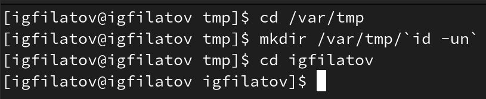{#fig:001 width=70%}

---

- **Создание образа виртуального диска**  
  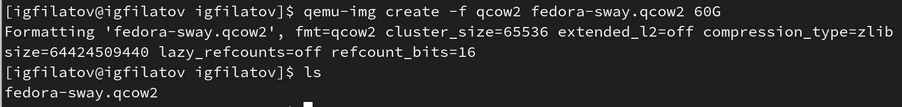{#fig:002 width=70%}

---

- **Запуск виртуальной машины**  
  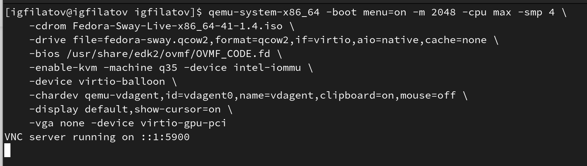{#fig:003 width=70%}

---

## Установка операционной системы

- **Запуск в Live режиме**  
  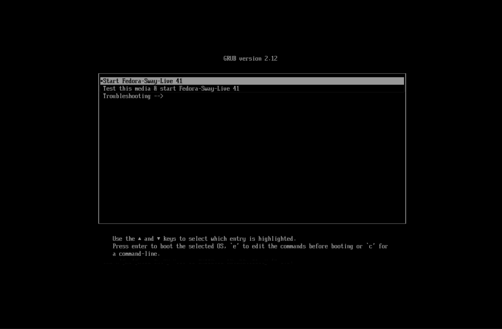{#fig:004 width=70%}

---

- **Запуск установки**  
  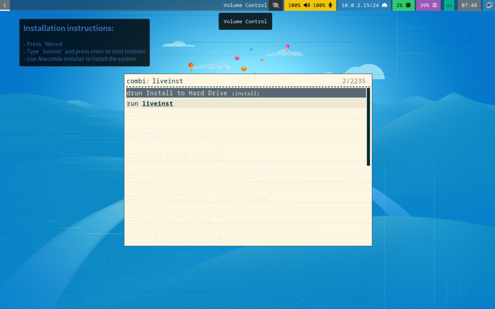{#fig:005 width=70%}

---

- **Процесс установки ОС**  
  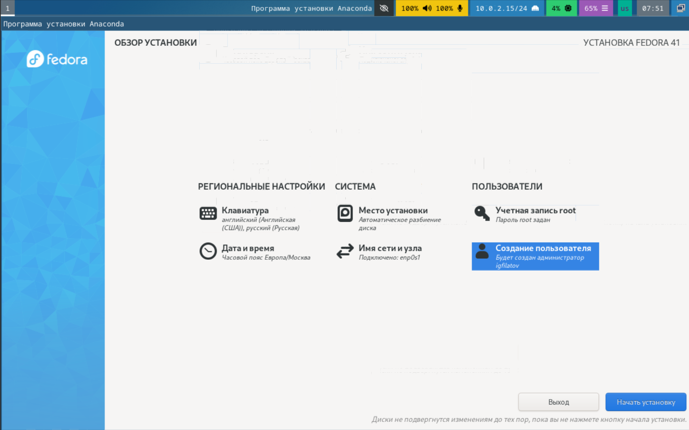{#fig:006 width=70%}

---

- **Создание исполняемого файла для запуска**  
  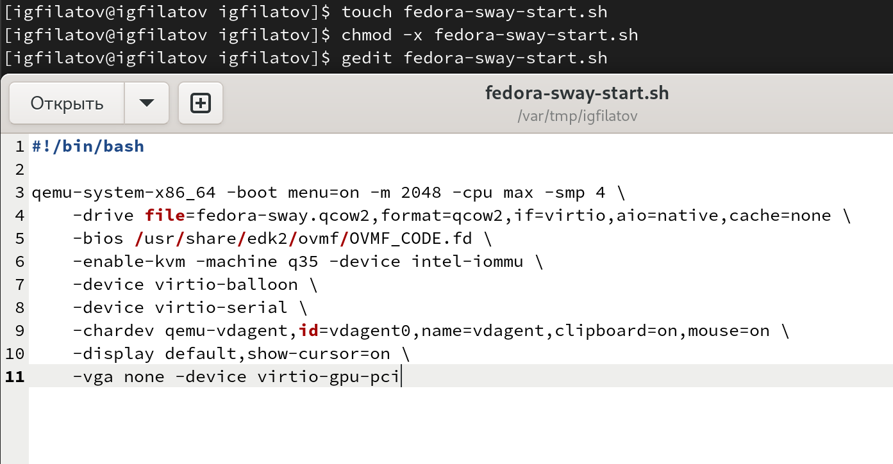{#fig:007 width=70%}

---

## Настройка системы после установки

- **Обновление пакетов**  
  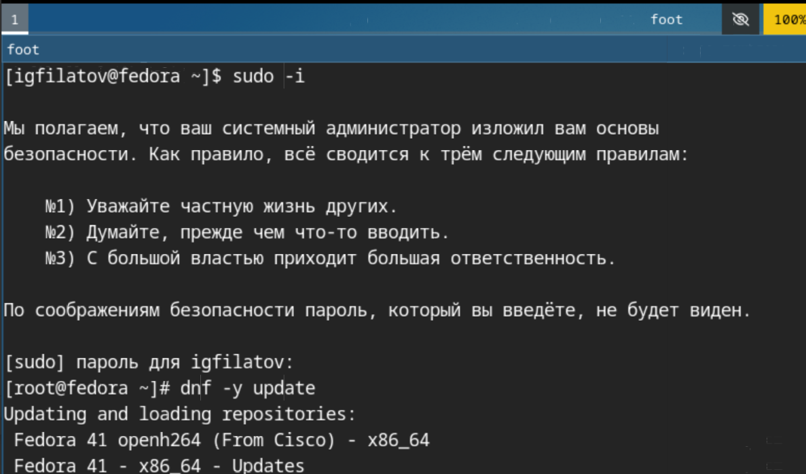{#fig:008 width=70%}

---

- **Установка утилит и автообновления**  
  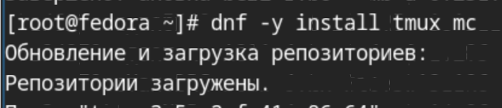{#fig:009 width=70%}  

---

  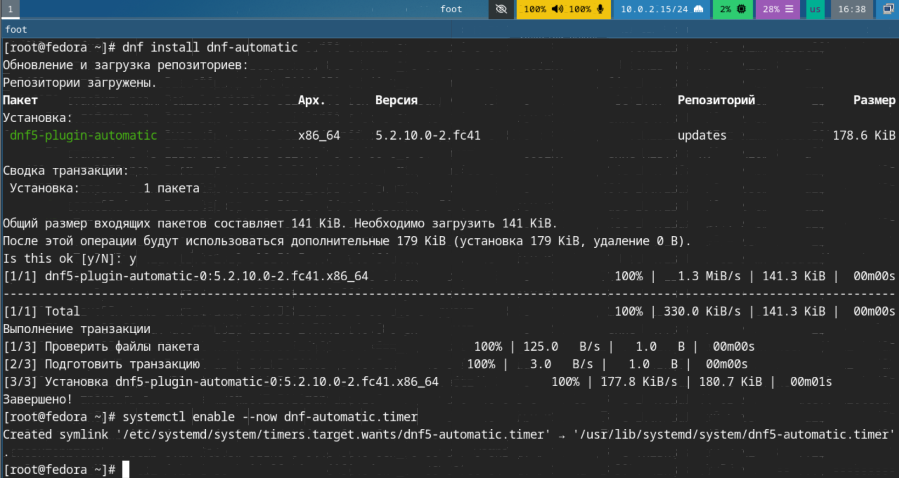{#fig:010 width=70%}

---

- **Отключение SELinux**  
  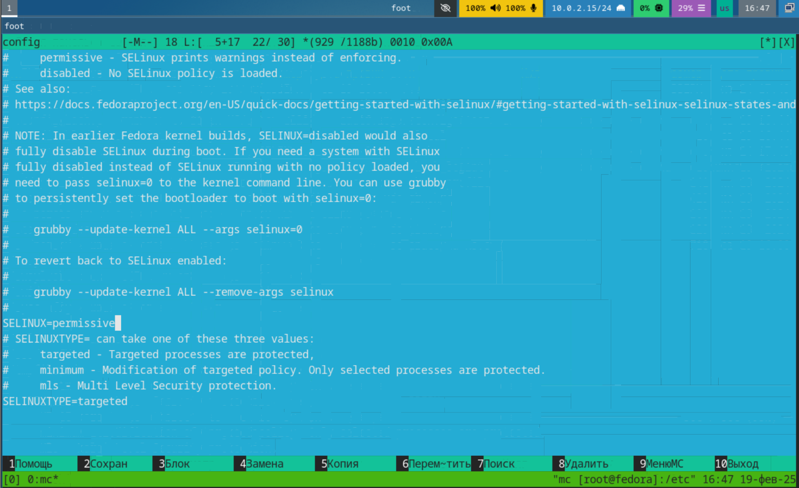{#fig:011 width=70%}

---

- **Настройка клавиатуры и имени хоста**  
  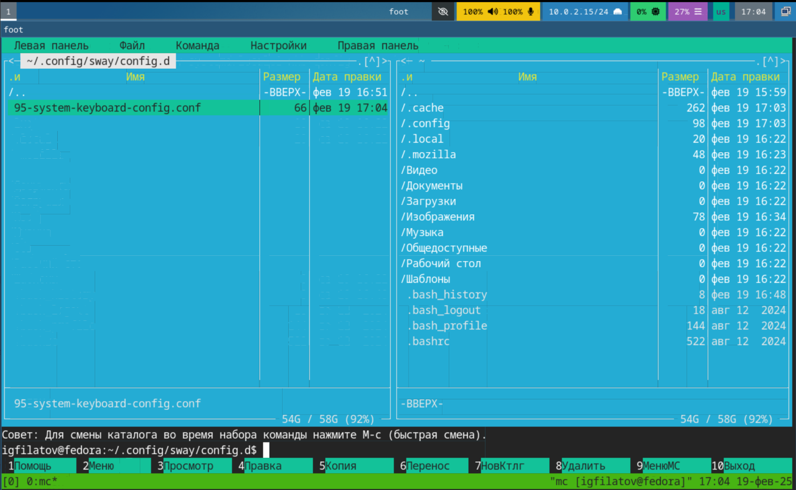{#fig:012 width=70%} 

---
 
  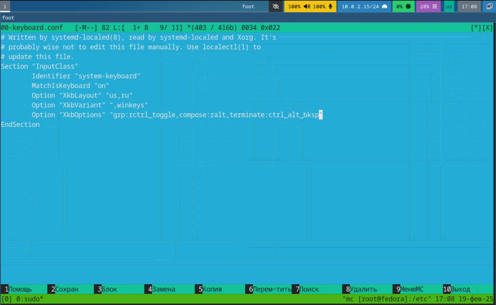{#fig:013 width=70%}  

---

  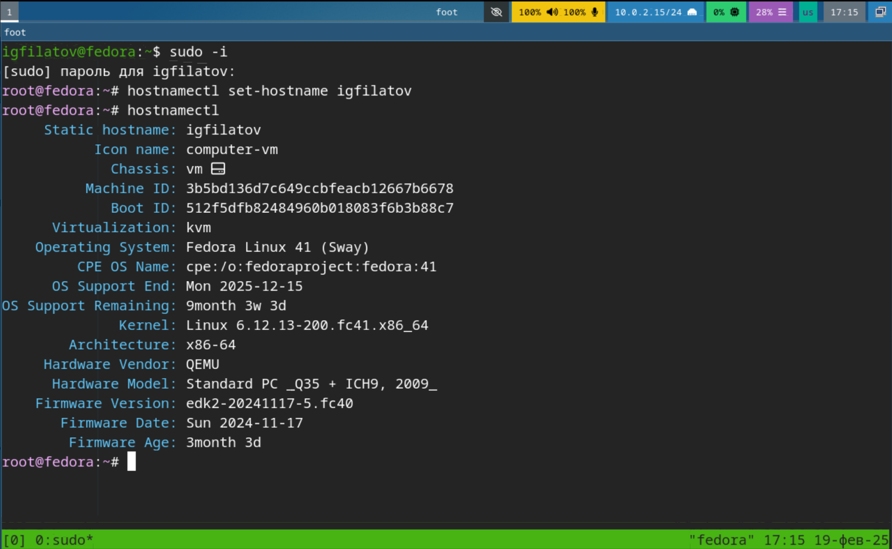{#fig:014 width=70%}

---

## Установка программного обеспечения

- **Установка pandoc и pandoc-crossref**  
  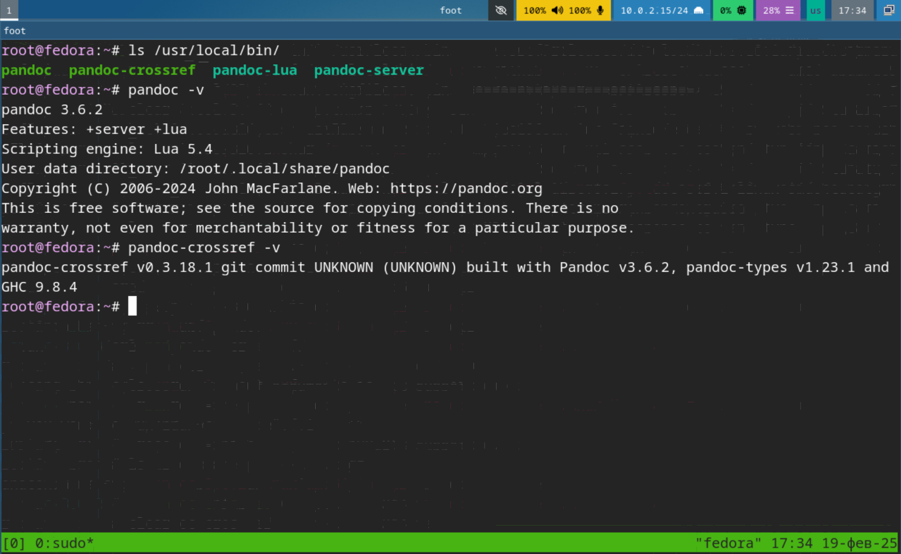{#fig:015 width=70%}

---

- **Установка TeXlive**  
  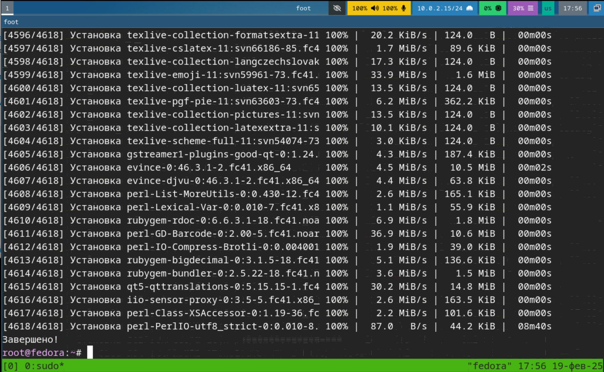{#fig:016 width=70%}

---

## Контрольные вопросы

- **Учётная запись пользователя:** содержит имя, пароль, UID, домашний каталог, shell и группы  
- **Команды терминала:** `man`, `cd`, `ls`, `chmod`, `history` и др.  
- **Файловая система:** иерархическая структура с основными каталогами (/bin, /etc, /home, /usr, /var)  
- **Монтирование:** команды `df -h`, `lsblk`  
- **Зависшие процессы:** управление с помощью `kill`, `kill -9`

---

## Задание для самостоятельной работы

- **Поиск данных в логах загрузки системы**  
  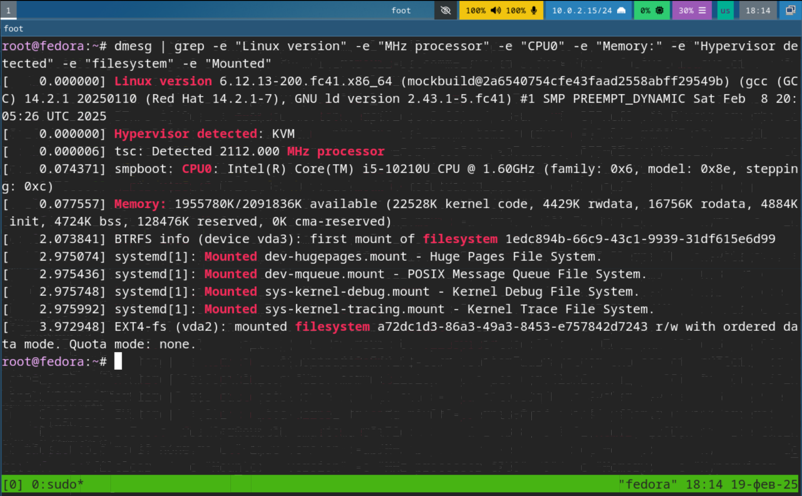{#fig:017 width=70%}

- **Полученные данные:**
  - Версия ядра: 6.12.13  
  - Частота процессора: 2112 MHz  
  - Модель процессора: Intel Core i5-10210U  
  - Объём оперативной памяти: 1955780 Кбайт  
  - Тип гипервизора: KVM  
  - Файловая система корневого раздела: EXT4

---

## Выводы

- Освоены навыки установки и настройки операционной системы  
- Получен практический опыт работы с виртуальными машинами  
- Подготовлены базовые знания для дальнейшей работы с md-документациями

---

## Спасибо за внимание!