---
## Front matter
title: "Отчёт по лабораторной работе №1"
subtitle: "Дисциплина: Операционные системы"
author: "Филатов Илья Гурамович"
 
## Generic options
lang: ru-RU
toc-title: "Содержание"
 
## Bibliography
bibliography: bib/cite.bib
csl: pandoc/csl/gost-r-7-0-5-2008-numeric.csl
 
## Pdf output format
toc: true # Table of contents
toc-depth: 2
lof: true # List of figures
fontsize: 12pt
linestretch: 1.5
papersize: a4
documentclass: scrreprt
## I18n polyglossia
polyglossia-lang:
  name: russian
  options:
    - spelling=modern
    - babelshorthands=true
polyglossia-otherlangs:
  name: english
## I18n babel
babel-lang: russian
babel-otherlangs: english
## Fonts
mainfont: IBM Plex Serif
romanfont: IBM Plex Serif
sansfont: IBM Plex Sans
monofont: IBM Plex Mono
mathfont: STIX Two Math
mainfontoptions: Ligatures=Common,Ligatures=TeX,Scale=0.94
romanfontoptions: Ligatures=Common,Ligatures=TeX,Scale=0.94
sansfontoptions: Ligatures=Common,Ligatures=TeX,Scale=MatchLowercase,Scale=0.94
monofontoptions: Scale=MatchLowercase,Scale=0.94,FakeStretch=0.9
mathfontoptions:
## Biblatex
biblatex: true
biblio-style: "gost-numeric"
biblatexoptions:
  - parentracker=true
  - backend=biber
  - hyperref=auto
  - language=auto
  - autolang=other*
  - citestyle=gost-numeric
## Pandoc-crossref LaTeX customization
figureTitle: "Рис."
tableTitle: "Таблица"
listingTitle: "Листинг"
lofTitle: "Список иллюстраций"
lotTitle: "Список таблиц"
lolTitle: "Листинги"
## Misc options
indent: true
header-includes:
  - \usepackage{indentfirst}
  - \usepackage{float} # keep figures where there are in the text
  - \floatplacement{figure}{H} # keep figures where there are in the text
---
 
# Цель работы
 
Приобрести навыки установки операционной системы на виртуальную машину и настройки минимально необходимых для дальнейшей работы сервисов.

# Задание
 
1. Подготовка Qemu к установке системы
2. Установка операционной системы
3. Настройка системы после установки
4. Установка программного обеспечения для создания документации

# Выполнение лабораторной работы
 
## Подготовка Qemu к установке системы
 
Открываю терминал. Создаю временный каталог для работы с Qemu и перехожу в него. Далее работу буду проводить в нём. (рис. [-@fig:001]).
 
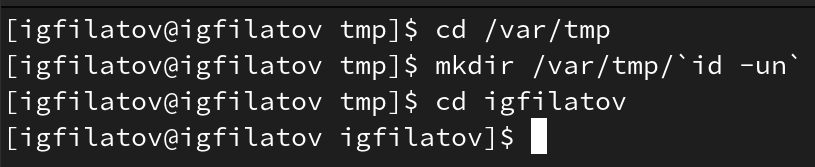{ #fig:001 width=70% }
 
Создаю образ виртуального диска (рис. [-@fig:002]).
 
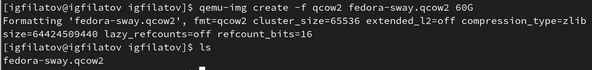{ #fig:002 width=70% }
 
Теперь запустим виртуальную машину используя Qemu. (рис. [-@fig:003]).
 
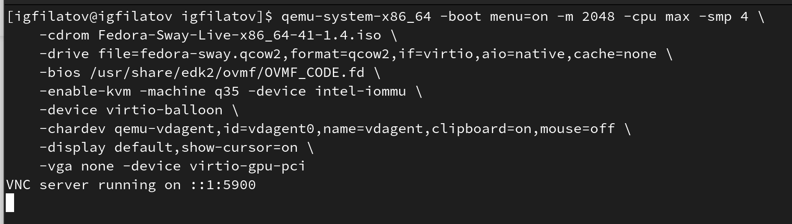{ #fig:003 width=70% }

## Установка операционной системы
 
Запускаем систему в Live режиме (рис. [-@fig:004]).
 
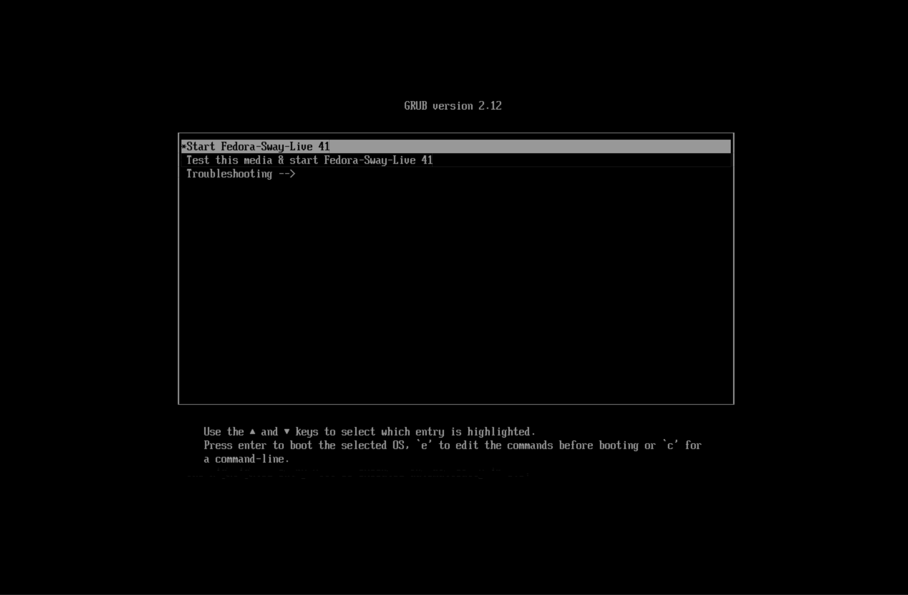{ #fig:004 width=70% }
 
Запускаю установку системы по подсказкам на экране (рис. [-@fig:005]).
 
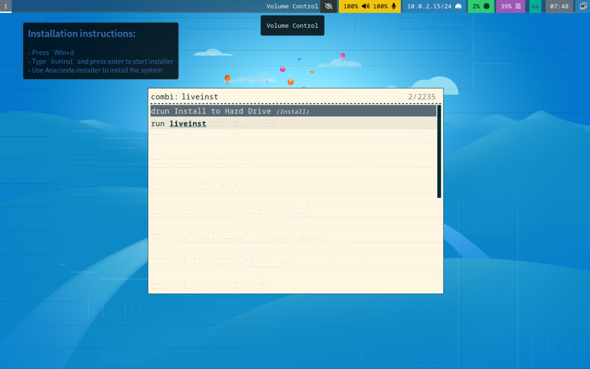{ #fig:005 width=70% }
 
Далее выполняю установку на диск выполняя необходимые этапы (рис. [-@fig:006]).
 
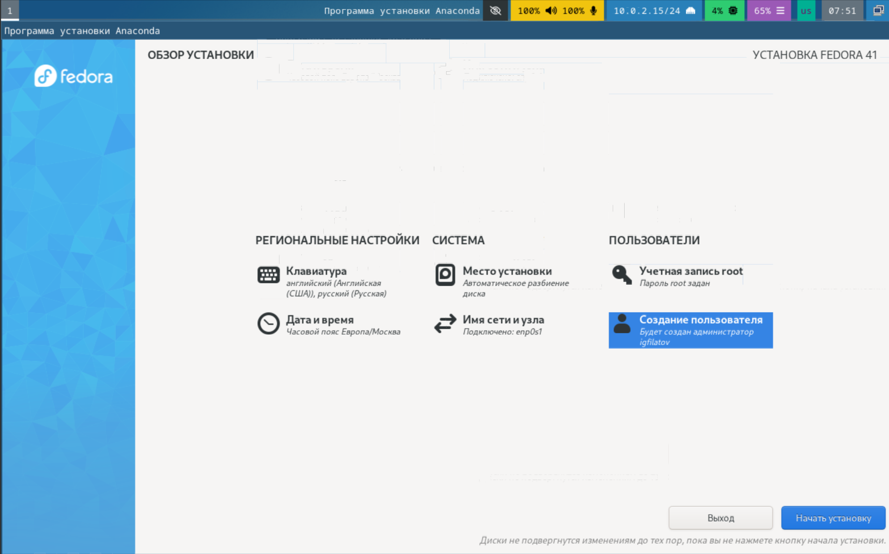{ #fig:006 width=70% }
 
Также после установки системы создаю исполняемый файл для удобства дальнейшего её запуска. (рис. [-@fig:007]).
 
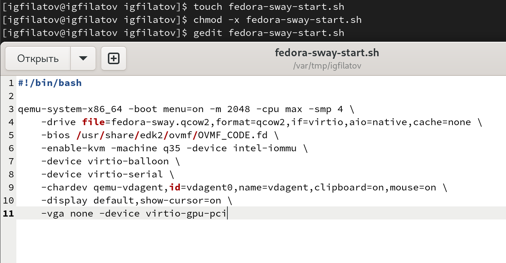{ #fig:007 width=70% }

## Настройка системы после установки

После установки откроем терминал используя Win+Enter переключимся на роль администратора и обновим все пакеты (рис. [-@fig:008]).
 
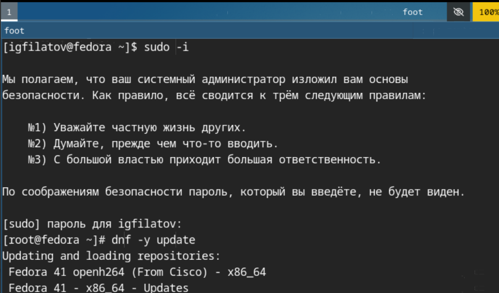{ #fig:008 width=70% }

Для повышения удобства использования системы установим дополнительные утилиты (рис. [-@fig:009]).
 
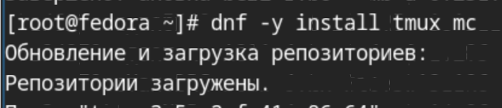{ #fig:009 width=70% }
 
Установим и настроим пакет автообновления (рис. [-@fig:010]).
 
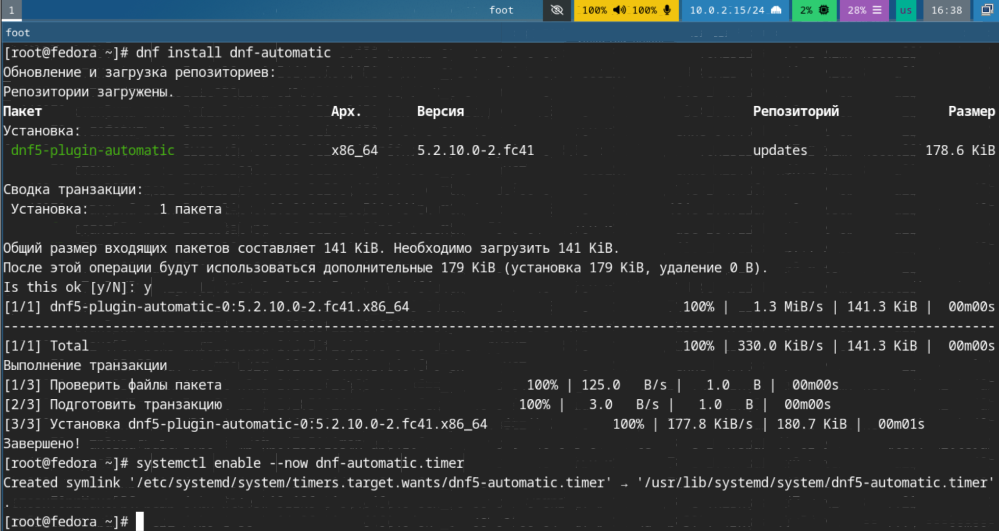{ #fig:010 width=70% }

Отключим SELinux поскольку не будем рассматривать работу с данной системой безопасности и перезагрузимся (рис. [-@fig:011]).
 
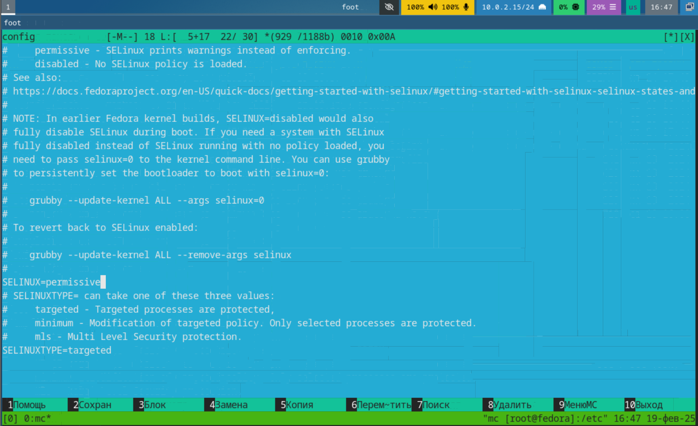{ #fig:011 width=70% }
 
### Также настроим раскладку для клавиатуры. 

Для этого сначала создадим и отредактируем конфигурационный файл пользователя (рис. [-@fig:012]).
 
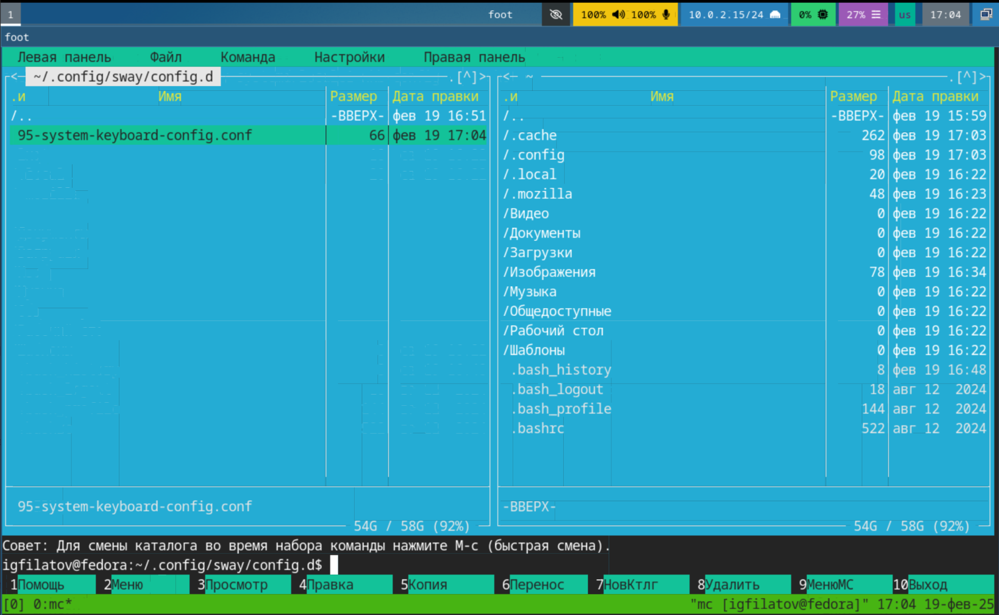{ #fig:012 width=70% }
 
А затем настроим общую конфигурацию (рис. [-@fig:013]).
 
{ #fig:013 width=70% }
 
Изменю имя хоста на свой логин (рис. [-@fig:014]).
 
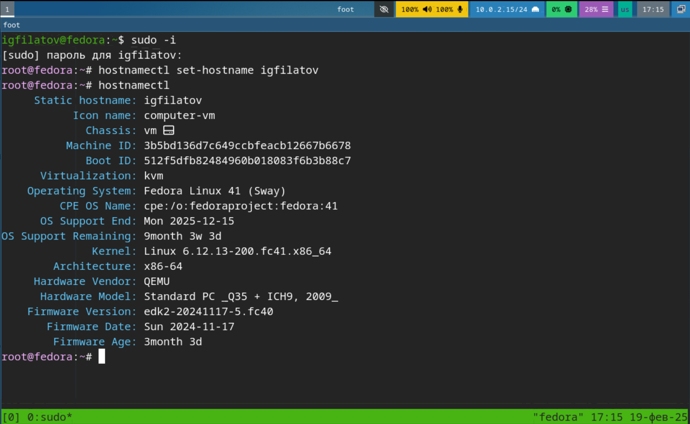{ #fig:014 width=70% }

### Установка программного обеспечения для создания документации

Скачаем и распакуем pandoc и pandoc-crossref, после переместим их исполняемые файлы в /usr/local/bin/ и проверим это (рис. [-@fig:015]).
 
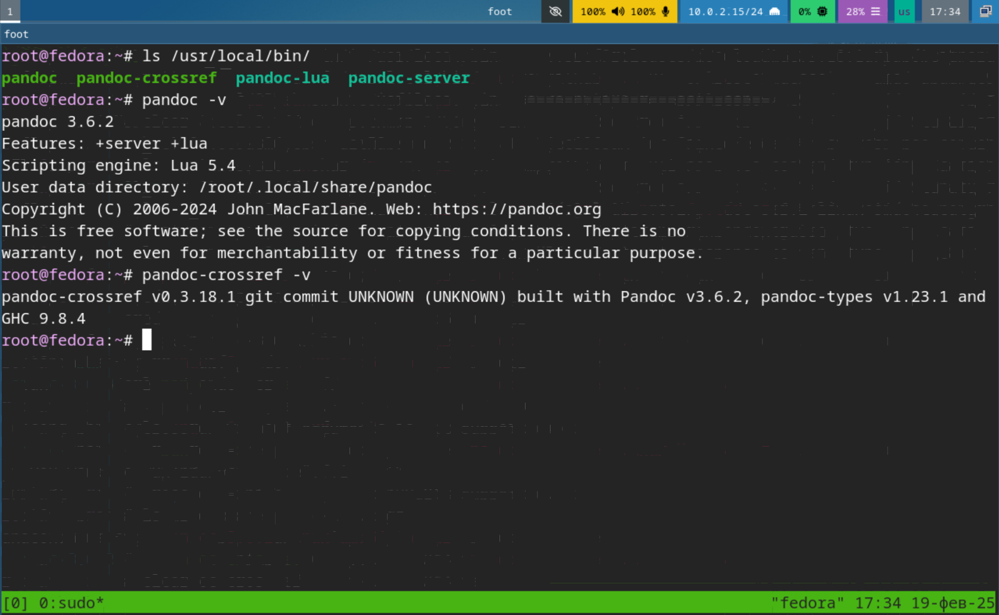{ #fig:015 width=70% }
 
Далее установим TeXlive (рис. [-@fig:016]).
 
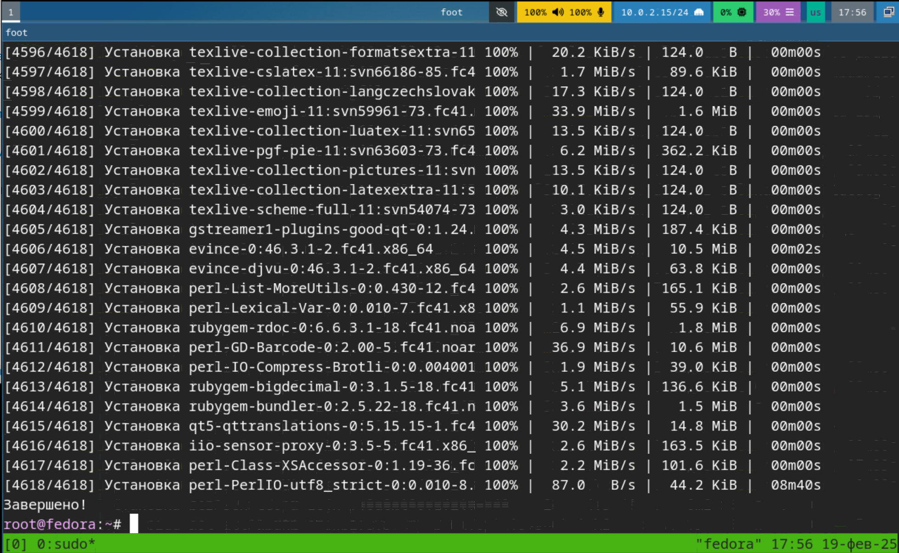{ #fig:016 width=70% }

## Ответы на контрольные вопросы

1. Учётная запись пользователя - Содержит: имя пользователя, пароль, UID, полное имя, домашний каталог, shell, GID и список групп
2. Команды терминала
- Справка: `man`, `--help`, `-h`
- Перемещение: `cd`, `pwd`
- Просмотр: `ls`, `ls -la`
- Объём: `du -sh`
- Каталоги/файлы: `mkdir`, `rmdir`, `rm`
- Права: `chmod`
- История: `history`
3. Файловая система
- Иерархическая структура с корнем (/)
- Основные каталоги: `/bin`, `/etc`, `/home`, `/usr`, `/var`
4. Монтирование
- Просмотр: `df -h`, `lsblk`
5. Зависшие процессы
- Завершение: `kill`, `kill -9`

## Задание для самостоятельной работы
 
Мне необходимо получить некоторые данные из логов последовательности загрузки системы. Выполнив комманду для поиска паттернов в выводе находим необходимые значения (рис. [-@fig:017]).

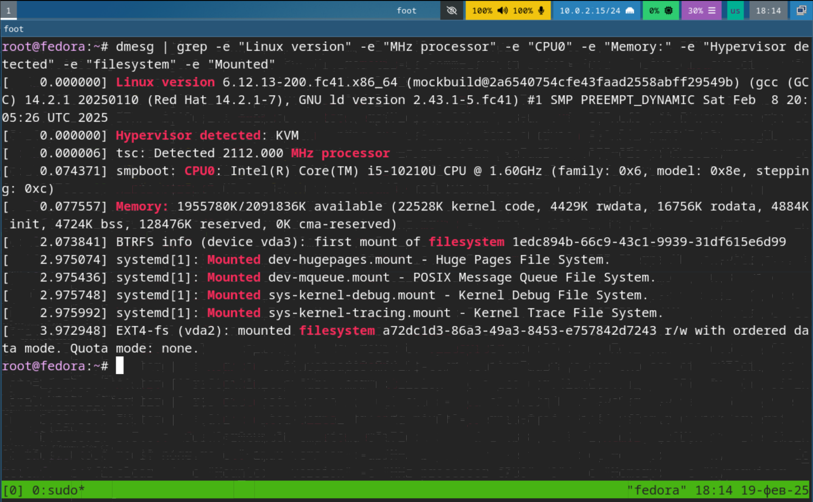{ #fig:017 width=70% }

И получаем что:

1. Версия нашего ядра - 6.12.13
2. Частота процессора - 2112 MHz
3. Модель процессора - Intel core i5-10210U
4. Объём доступной оперативной памяти - 1955780 Кбайт
5. Тип обнаруженного гипервизора - KVM
6. Тип файловой системы корневого раздела - EXT4

7. Последовательность монтирования файловых систем:

 * Huge Pages File System
 * POSIX Message File System
 * Kernel Debug File System
 * Kernel Trace File System

# Выводы
 
Я приобрёл навыки установки и настройки операционной системы для дальнейшей работы с md документациями
 
# Список литературы
 
1. [Архитектура ЭВМ](https://esystem.rudn.ru/pluginfile.php/2089548/mod_resource/content/0/%D0%9B%D0%B0%D0%B1%D0%BE%D1%80%D0%B0%D1%82%D0%BE%D1%80%D0%BD%D0%B0%D1%8F%20%D1%80%D0%B0%D0%B1%D0%BE%D1%82%D0%B0%20%E2%84%968.%20%D0%9F%D1%80%D0%BE%D0%B3%D1%80%D0%B0%D0%BC%D0%BC%D0%B8%D1%80%D0%BE%D0%B2%D0%B0%D0%BD%D0%B8%D0%B5%20%D1%86%D0%B8%D0%BA%D0%BB%D0%B0.%20%D0%9E%D0%B1%D1%80%D0%B0%D0%B1%D0%BE%D1%82%D0%BA%D0%B0%20%D0%B0%D1%80%D0%B3%D1%83%D0%BC%D0%B5%D0%BD%D1%82%D0%BE%D0%B2%20%D0%BA%D0%BE%D0%BC%D0%B0%D0%BD%D0%B4%D0%BD%D0%BE%D0%B9%20%D1%81%D1%82%D1%80%D0%BE%D0%BA%D0%B8..pdf)