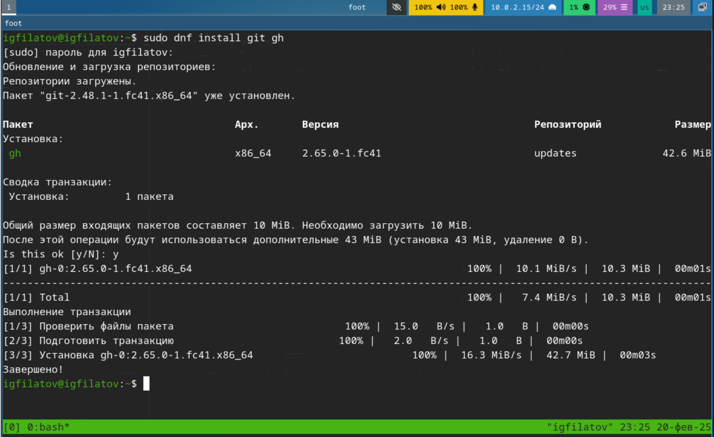
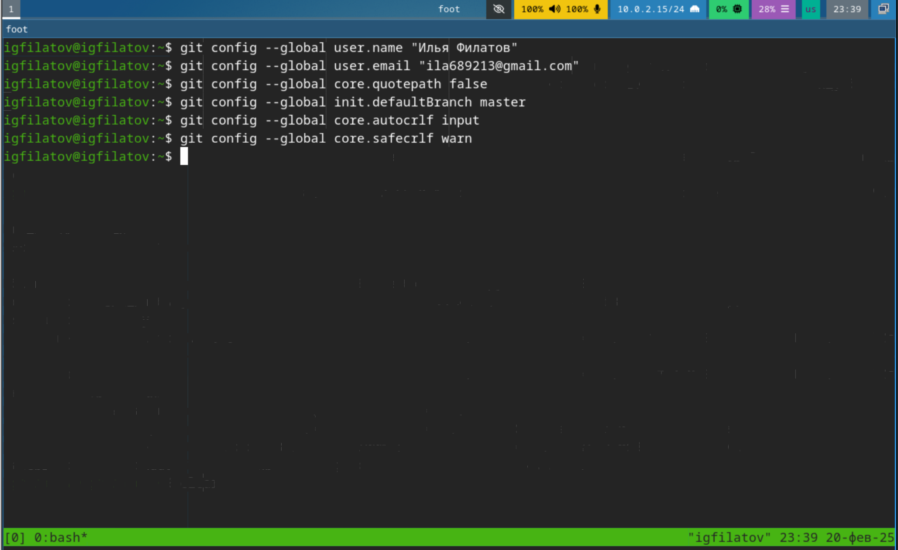
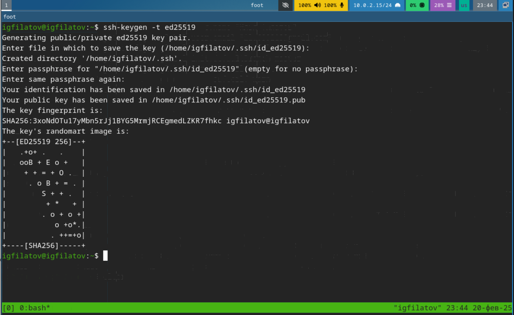
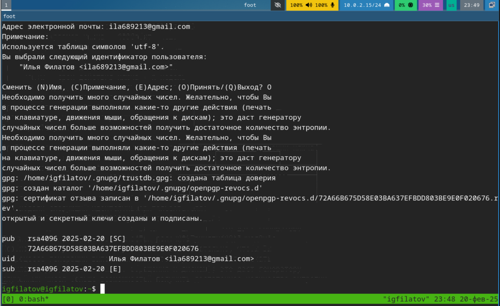
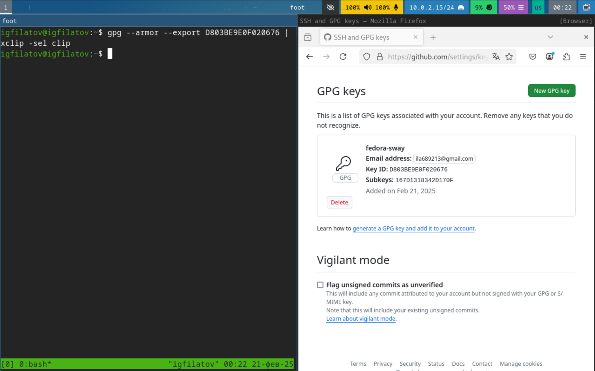
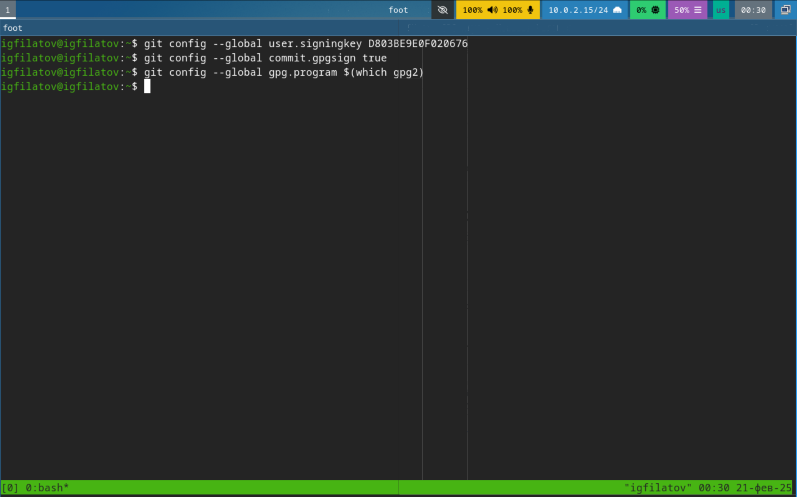
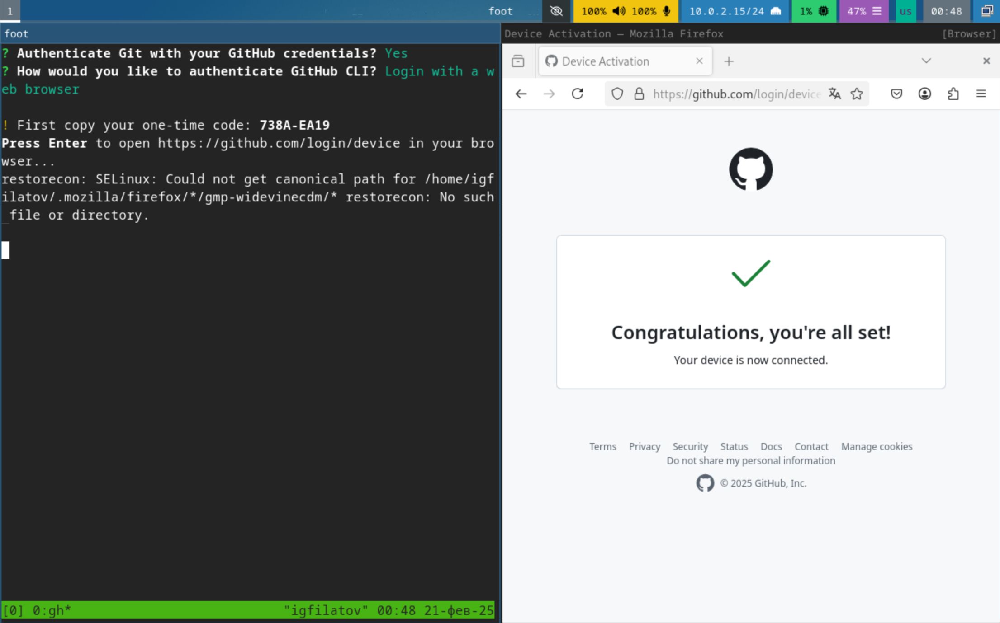
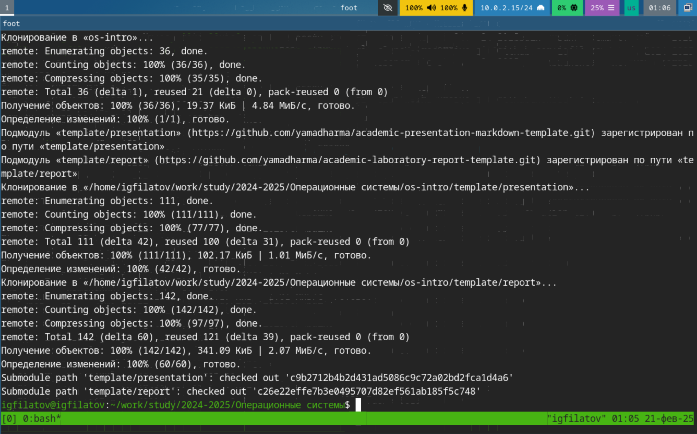
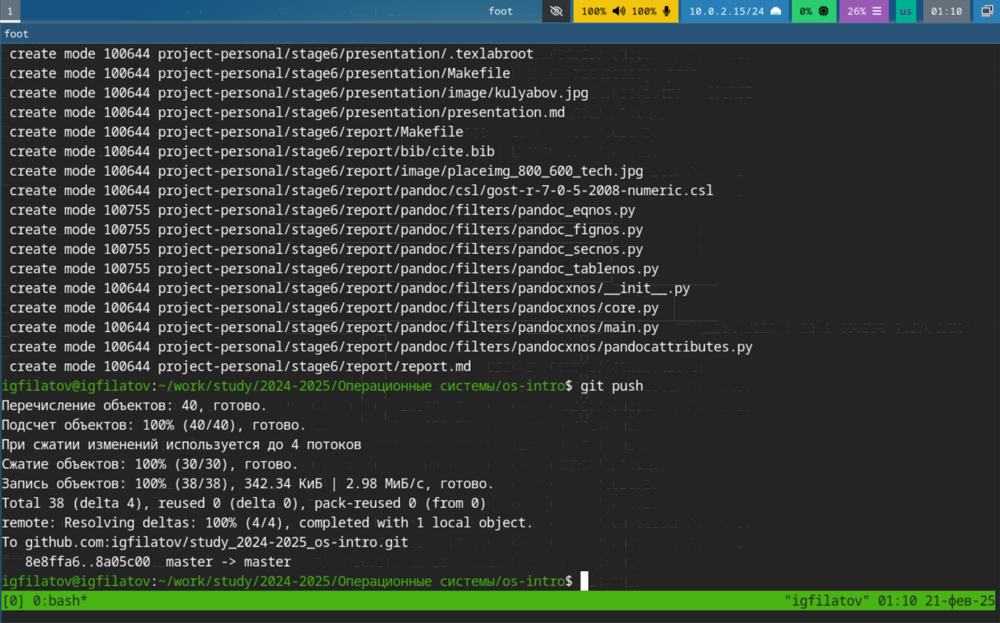

## Цель работы

- Изучить идеологию и применение систем контроля версий  
- Освоить базовые навыки работы с **git**  
- Познакомиться с настройкой SSH/PGP ключей и автоматизацией подписи коммитов

---

## Задание

- Настроить базовую конфигурацию для работы с git  
- Создать ключ SSH и ключ PGP  
- Настроить автоматические подписи коммитов  
- Зарегистрироваться на GitHub  
- Организовать локальный каталог для курсовых заданий

---

## Установка программного обеспечения

---

- **Установка git и gh**  
  {#fig:001 width=70%}  

---

  {#fig:002 width=70%}

---

## Создание ключей

---

- **Создание SSH ключа (алгоритм ed25519)**  
  {#fig:003 width=70%}

---

- **Создание PGP ключа**  
  {#fig:004 width=70%}

---

## Настройка GitHub и подписей

---

- **Добавление PGP ключа в GitHub**  
  {#fig:005 width=70%}

---

- **Настройка автоматических подписей коммитов в git**  
  {#fig:006 width=70%}

---

## Авторизация и организация репозитория

---

- **Авторизация через gh**  
  {#fig:007 width=70%}

---

- **Создание репозитория по шаблону**  
  {#fig:008 width=70%}

---

- **Настройка каталога курса и отправка файлов на сервер**  
  {#fig:009 width=70%}

---

## Выводы

- Получены навыки установки и настройки git и gh  
- Освоены процессы создания и использования SSH/PGP ключей  
- Понимание принципов работы систем контроля версий существенно укреплено

---

## Спасибо за внимание!