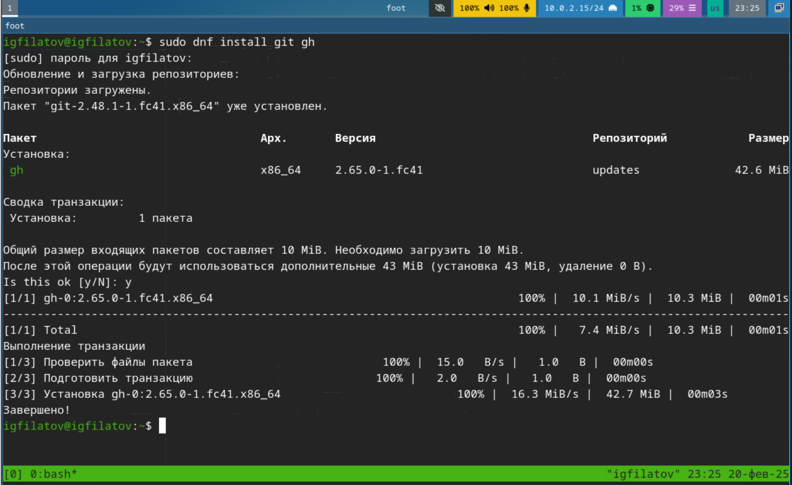
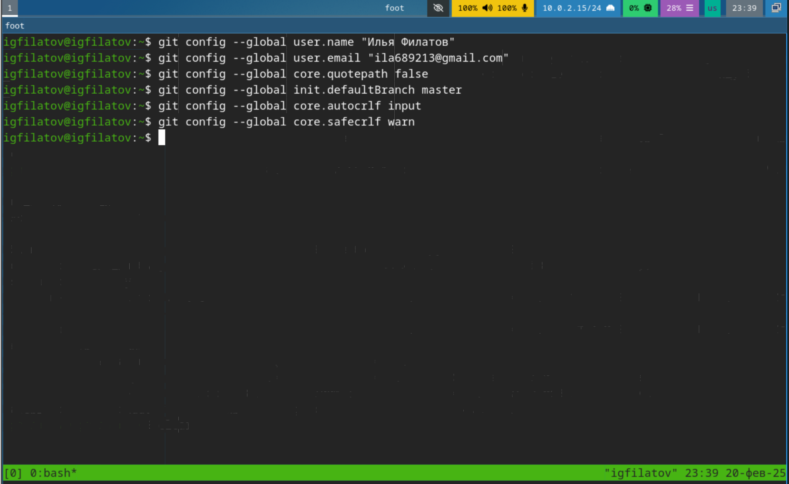
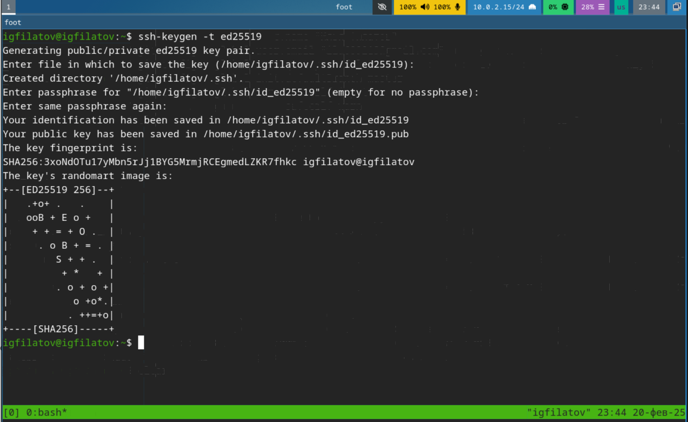
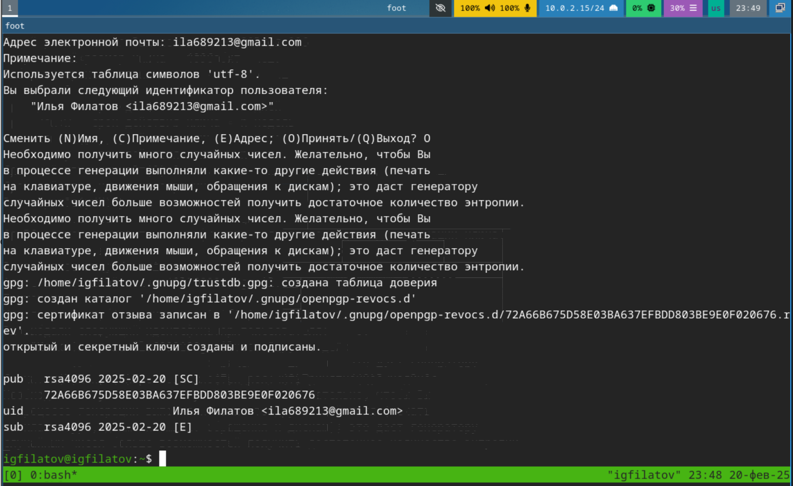
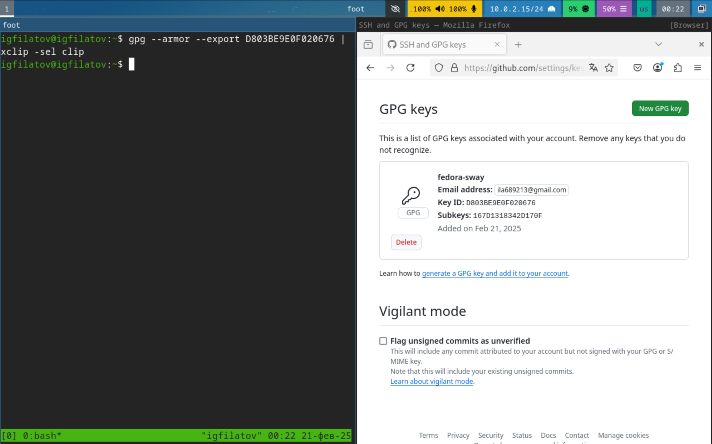
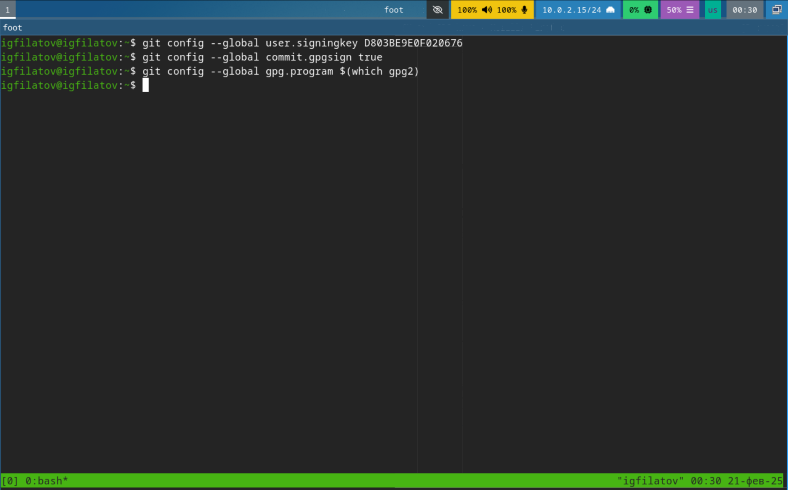
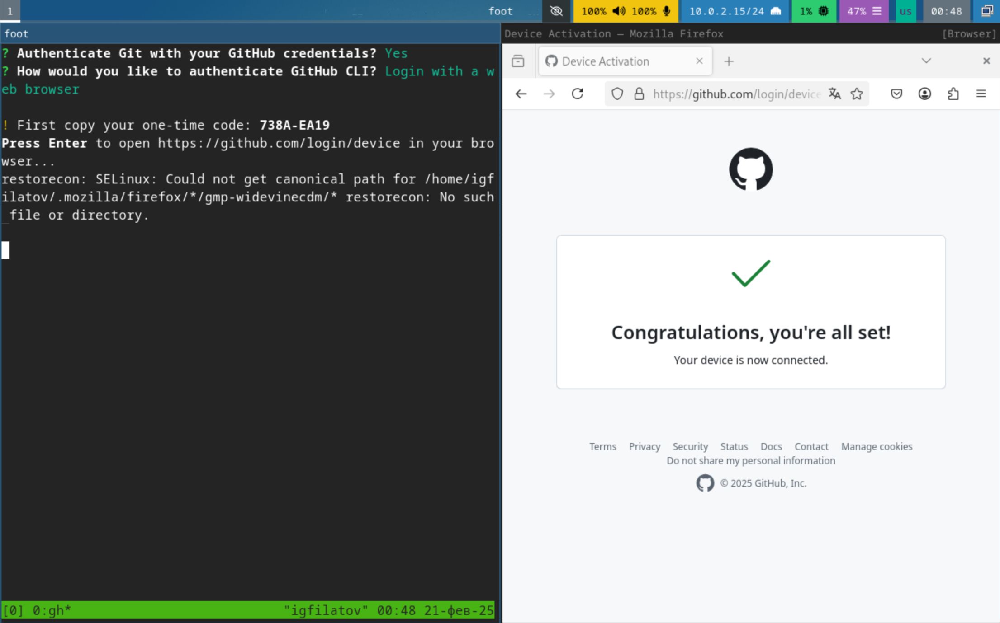
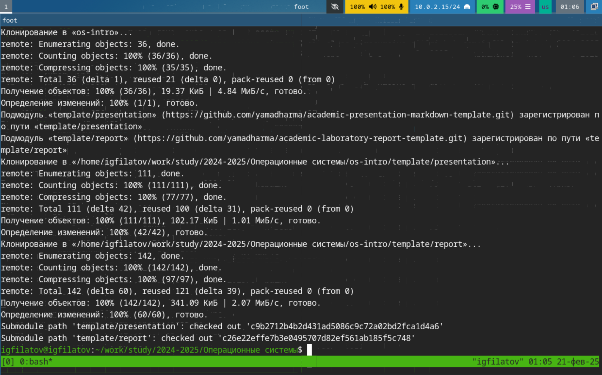
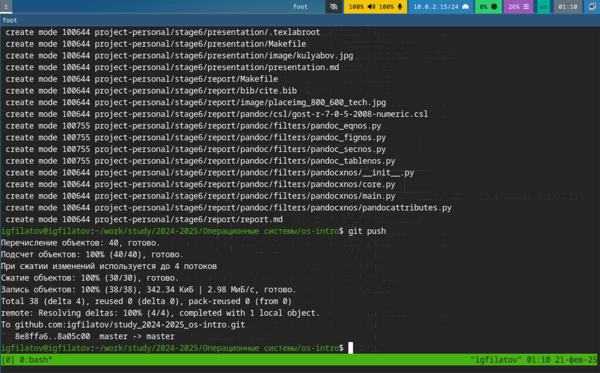

---
## Front matter
title: "Отчёт по лабораторной работе №2"
subtitle: "Дисциплина: Операционные системы"
author: "Филатов Илья Гурамович"
 
## Generic options
lang: ru-RU
toc-title: "Содержание"
 
## Bibliography
bibliography: bib/cite.bib
csl: pandoc/csl/gost-r-7-0-5-2008-numeric.csl
 
## Pdf output format
toc: true # Table of contents
toc-depth: 2
lof: true # List of figures
fontsize: 12pt
linestretch: 1.5
papersize: a4
documentclass: scrreprt
## I18n polyglossia
polyglossia-lang:
  name: russian
  options:
    - spelling=modern
    - babelshorthands=true
polyglossia-otherlangs:
  name: english
## I18n babel
babel-lang: russian
babel-otherlangs: english
## Fonts
mainfont: IBM Plex Serif
romanfont: IBM Plex Serif
sansfont: IBM Plex Sans
monofont: IBM Plex Mono
mathfont: STIX Two Math
mainfontoptions: Ligatures=Common,Ligatures=TeX,Scale=0.94
romanfontoptions: Ligatures=Common,Ligatures=TeX,Scale=0.94
sansfontoptions: Ligatures=Common,Ligatures=TeX,Scale=MatchLowercase,Scale=0.94
monofontoptions: Scale=MatchLowercase,Scale=0.94,FakeStretch=0.9
mathfontoptions:
## Biblatex
biblatex: true
biblio-style: "gost-numeric"
biblatexoptions:
  - parentracker=true
  - backend=biber
  - hyperref=auto
  - language=auto
  - autolang=other*
  - citestyle=gost-numeric
## Pandoc-crossref LaTeX customization
figureTitle: "Рис."
tableTitle: "Таблица"
listingTitle: "Листинг"
lofTitle: "Список иллюстраций"
lotTitle: "Список таблиц"
lolTitle: "Листинги"
## Misc options
indent: true
header-includes:
  - \usepackage{indentfirst}
  - \usepackage{float} # keep figures where there are in the text
  - \floatplacement{figure}{H} # keep figures where there are in the text
---
 
# Цель работы
- Изучить идеологию и применение средств контроля версий.
- Освоить умения по работе с git.
 
 
# Задание

1. Создать базовую конфигурацию для работы с git.
- Создать ключ SSH.
- Создать ключ PGP.
- Настроить подписи git.
- Зарегистрироваться на Github.
- Cоздать локальный каталог для выполнения заданий по предмету.
 
# Выполнение лабораторной работы
 
## Установка программного обеспечения
 
Установим git и gh (рис. [-@fig:001]).
 
{ #fig:001 width=70% }
 
Зададим базовые параметры git, также пропустим шаг регистрации на GitHub поскольку это уже было выполнено (рис. [-@fig:002]).
 
{ #fig:002 width=70% }

## Создание SSH ключей

Создадим ключ SSH по алгоритму ed25519 (рис. [-@fig:003]).
 
{ #fig:003 width=70% }

## Создание PGP ключа

Используя комманду генерирую ключ и ввожу свои данные (рис. [-@fig:004]).
 
{ #fig:004 width=70% }

## Добавление PGP ключа в GitHub
 
Копирую свой PGP ключ используя инструмент xclip используется для копирования содержимого файла в буфер обмена, а флаг -selection clipboard делает так, чтобы скопированные данные были доступны для вставки через Ctrl + V. Добавляю данный ключ в github (рис. [-@fig:005]).
 
{ #fig:005 width=70% }

## Настройка автоматических подписей коммитов git
 
Далее добавляю в конфиг авторизацию PGP (рис. [-@fig:006]).
 
{ #fig:006 width=70% }

## Настройка gh
 
Проходим авторизацию постепенно отвечая на вопросы утилиты (рис. [-@fig:007]).
 
{ #fig:007 width=70% }

## Сознание репозитория курса на основе шаблона

После настройки создам свой репозиторий на основе шаблона (рис. [-@fig:008]).
 
{ #fig:008 width=70% }

Наконец настроим каталог курса перейдя в него и удалив лишние файлы, после создадим каталоги и отправим файлы на сервер (рис. [-@fig:009]).
 
{ #fig:009 width=70% }
 
## Ответы на контрольные вопросы

1. Системы контроля версий (VCS) представляют собой программные инструменты, которые помогают отслеживать изменения в коде или других файлах проекта во времени, обеспечивая возможность совместной работы над проектом и восстановления предыдущих версий.
- В системах контроля версий хранилище содержит все версии файлов, commit фиксирует конкретное состояние изменений, история представляет собой запись всех внесенных изменений, а рабочая копия является локальной версией файлов для непосредственной работы.
- Централизованные VCS (например, SVN) используют один центральный сервер-хранилище, тогда как децентрализованные системы (например, Git) позволяют каждому разработчику иметь полную копию репозитория на своем компьютере.
- При единоличной работе с хранилищем VCS пользователь последовательно создает изменения в рабочей копии, фиксирует их через commit и может при необходимости возвращаться к предыдущим версиям.
- При работе с общим хранилищем VCS разработчики синхронизируют свои локальные изменения с центральным репозиторием через операции pull и push, что позволяет избежать конфликтов при параллельной работе над проектом.
- Git решает основные задачи отслеживания изменений в коде, управления различными версиями проекта и организации эффективного процесса совместной разработки через систему веток и коммитов.
- Команды git включают базовые операции создания и управления репозиторием (init, clone), регистрации изменений (add), фиксации состояний (commit), синхронизации с удаленным репозиторием (push, pull) и переключения между версиями (checkout).
- При работе с локальным репозиторием используются команды add и commit для фиксации изменений, а при взаимодействии с удаленным репозиторием добавляются команды push для отправки изменений и pull для получения обновлений из центрального хранилища.
- Ветви (branches) позволяют параллельно разрабатывать различные функциональности проекта независимо друг от друга, что особенно полезно при реализации новых возможностей или исправлении ошибок без влияния на стабильную версию кода.
- Игнорирование определенных файлов через .gitignore необходимо для исключения из системы контроля версий временных файлов, конфигураций IDE и других данных, которые не должны попадать в общий репозиторий проекта.

# Выводы
 
Я приобрёл навыки установки и настройки применения и настройки средств контроля версий
 
# Список литературы
 
1. [Архитектура ЭВМ](https://esystem.rudn.ru/pluginfile.php/2089548/mod_resource/content/0/%D0%9B%D0%B0%D0%B1%D0%BE%D1%80%D0%B0%D1%82%D0%BE%D1%80%D0%BD%D0%B0%D1%8F%20%D1%80%D0%B0%D0%B1%D0%BE%D1%82%D0%B0%20%E2%84%968.%20%D0%9F%D1%80%D0%BE%D0%B3%D1%80%D0%B0%D0%BC%D0%BC%D0%B8%D1%80%D0%BE%D0%B2%D0%B0%D0%BD%D0%B8%D0%B5%20%D1%86%D0%B8%D0%BA%D0%BB%D0%B0.%20%D0%9E%D0%B1%D1%80%D0%B0%D0%B1%D0%BE%D1%82%D0%BA%D0%B0%20%D0%B0%D1%80%D0%B3%D1%83%D0%BC%D0%B5%D0%BD%D1%82%D0%BE%D0%B2%20%D0%BA%D0%BE%D0%BC%D0%B0%D0%BD%D0%B4%D0%BD%D0%BE%D0%B9%20%D1%81%D1%82%D1%80%D0%BE%D0%BA%D0%B8..pdf)