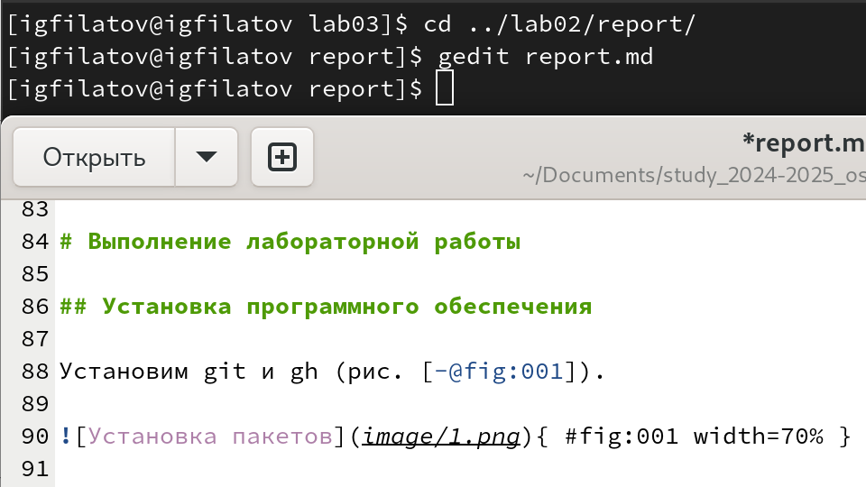
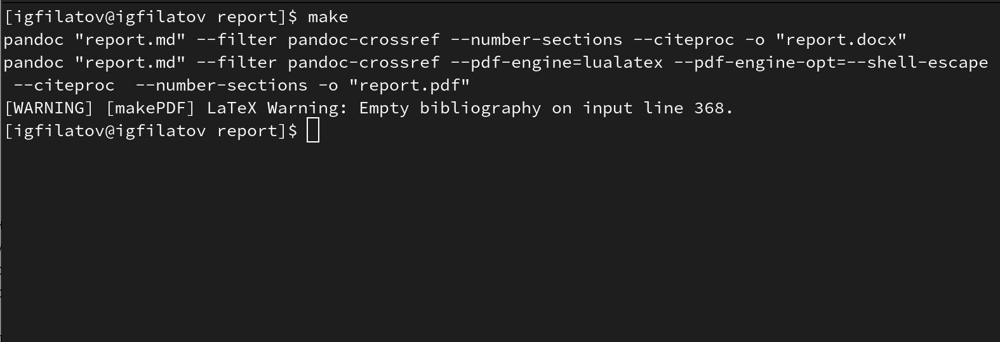

# Презентация по лабораторной работе №3

---

## Цель работы
- Изучить возможности языка разметки Markdown
- Освоить базовые элементы форматирования текста
- Научиться конвертации документов в различные форматы

---

## Основные возможности Markdown
- **Заголовки:** использование символа `#`
- **Форматирование текста:**
  * Полужирный: `**текст**`
  * Курсив: `*текст*`
  * Полужирный курсив: `***текст***`
- **Списки:** упорядоченные и неупорядоченные
- **Цитаты:** использование символа `>`
- **Код:** тройное обратное апострофирование

---

## Задание
- Оформить отчёт в формате Markdown
- Добавить титульный лист, введение и основную часть
- Сгенерировать документы в форматах md, pdf и docx
- Создать Makefile для автоматизации преобразования

---

## Выполнение лабораторной работы
- Переход в каталог старой лабораторной работы и выполнение в формате Markdown
{#fig:001 width=70%}

---

- Генерация отчёта в форматах md, pdf и docx с помощью Makefile
{#fig:002 width=70%}

---

## Выводы
- Получены навыки работы с Markdown
- Освоено форматирование текста
- Научились автоматизировать конвертацию документов

---

## Спасибо за внимание!