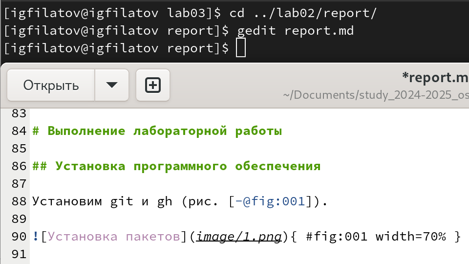
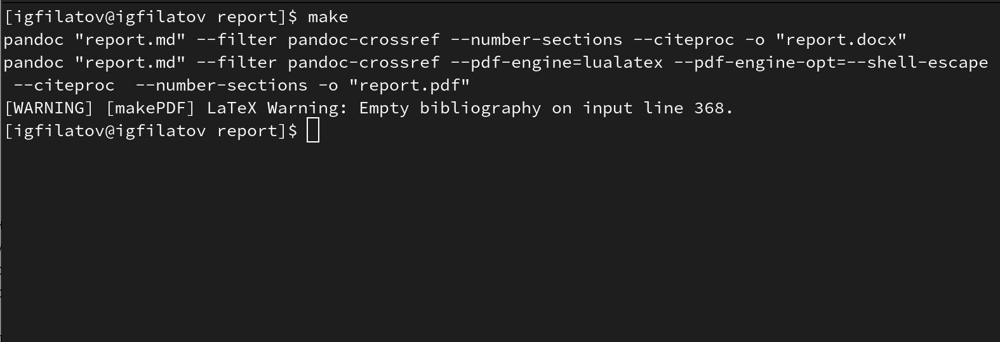

# Цель работы

Цель данной лабораторной работы – научиться оформлять отчёты с помощью легковесного языка разметки **Markdown**. В ходе работы изучаются базовые возможности Markdown, а также способы его конвертации в различные форматы (PDF, DOCX).

---

# Предварительные сведения

Markdown – это простой язык разметки, позволяющий быстро и эффективно оформлять текстовые документы. В работе рассмотрены следующие возможности:

- **Заголовки:**  
  Используются символы `#` для обозначения заголовков разных уровней, например:
`# Заголовок 1`
`## Заголовок 2`
`### Заголовок 3`

- **Форматирование текста:**  
- **Полужирный:** заключение текста в двойные звездочки, например: `**текст**`
- *Курсив:* заключение текста в одинарные звездочки, например: `*текст*`
- ***Полужирный и курсив:*** заключение в тройные звездочки, например: `***текст***`
- **Цитаты:** Используется символ `>` для создания блоков цитирования, например:  `> Это пример цитаты.`
- **Списки:**  
- Неупорядоченные списки оформляются с помощью тире или звездочек:
  ```
  - Пункт 1
  - Пункт 2
  ```
- Упорядоченные списки нумеруются цифрами:
  ```
  1. Первый пункт
  2. Второй пункт
  ```

- **Код и формулы:**  
Для выделения фрагментов кода используется тройное обратное апострофирование:
```echo "Hello, Markdown!"```

Формулы можно писать, используя синтаксис LaTeX, например:  
`$\sin^2(x) + \cos^2(x) = 1$`

- **Ссылки:**  
Синтаксис встраивания ссылок: `[текст ссылки](URL)`

---

# Задание

В рамках лабораторной работы необходимо:
- Подготовить отчёт по предыдущей лабораторной работе в формате Markdown.
- Оформить документ в соответствии с требованиями (наличие титульного листа, введения, основной части, заключения и списка литературы).
- Сгенерировать отчёт в трёх форматах: **md**, **pdf** и **docx** (для конвертации использовать [Pandoc](https://pandoc.org/) и [pandoc-crossref](https://github.com/lierdakil/pandoc-crossref)).

Также использовать Makefile для автоматизации процесса преобразования файлов.

---

# Выполнение лабораторной работы

Перехожу в каталог старой лабораторной работы и выполняю его в формате Markdown учитывая необходимые требования (рис. [-@fig:001]).

{ #fig:001 width=70% }

Используя Makefile генерирую отчёт в форматах **md** **pdf** и **docx**  (рис. [-@fig:002]).

{ #fig:002 width=70% }

---

# Выводы

В результате выполнения лабораторной работы:
- Были изучены базовые возможности языка Markdown, включая создание заголовков, форматирование текста, работу со списками, цитатами, вставку кода и формул.
- Отчёт по предыдущей лабораторной работе успешно оформлен в Markdown и готов к преобразованию в форматы PDF и DOCX с помощью Pandoc.
- Полученные навыки позволят в дальнейшем быстро и эффективно готовить научные и технические документы.

---

# Список литературы

1. [Архитектура ЭВМ](https://esystem.rudn.ru/pluginfile.php/2089548/mod_resource/content/0/%D0%9B%D0%B0%D0%B1%D0%BE%D1%80%D0%B0%D1%82%D0%BE%D1%80%D0%BD%D0%B0%D1%8F%20%D1%80%D0%B0%D0%B1%D0%BE%D1%82%D0%B0%20%E2%84%968.%20%D0%9F%D1%80%D0%BE%D0%B3%D1%80%D0%B0%D0%BC%D0%BC%D0%B8%D1%80%D0%BE%D0%B2%D0%B0%D0%BD%D0%B8%D0%B5%20%D1%86%D0%B8%D0%BA%D0%BB%D0%B0.%20%D0%9E%D0%B1%D1%80%D0%B0%D0%B1%D0%BE%D1%82%D0%BA%D0%B0%20%D0%B0%D1%80%D0%B3%D1%83%D0%BC%D0%B5%D0%BD%D1%82%D0%BE%D0%B2%20%D0%BA%D0%BE%D0%BC%D0%B0%D0%BD%D0%B4%D0%BD%D0%BE%D0%B9%20%D1%81%D1%82%D1%80%D0%BE%D0%BA%D0%B8..pdf)