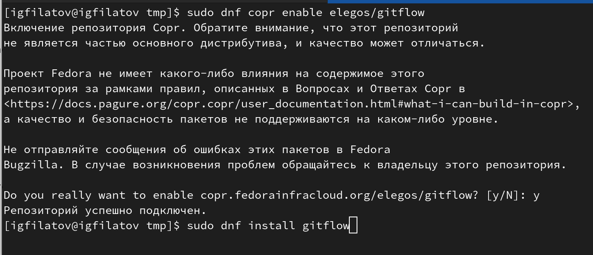
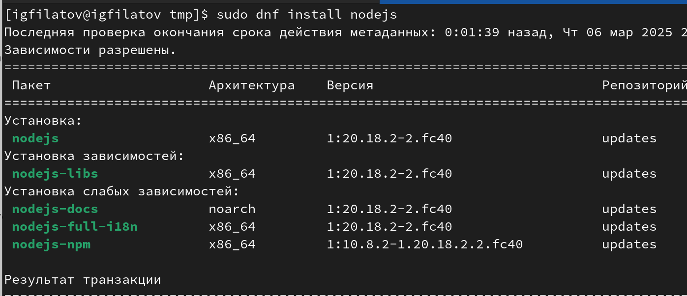
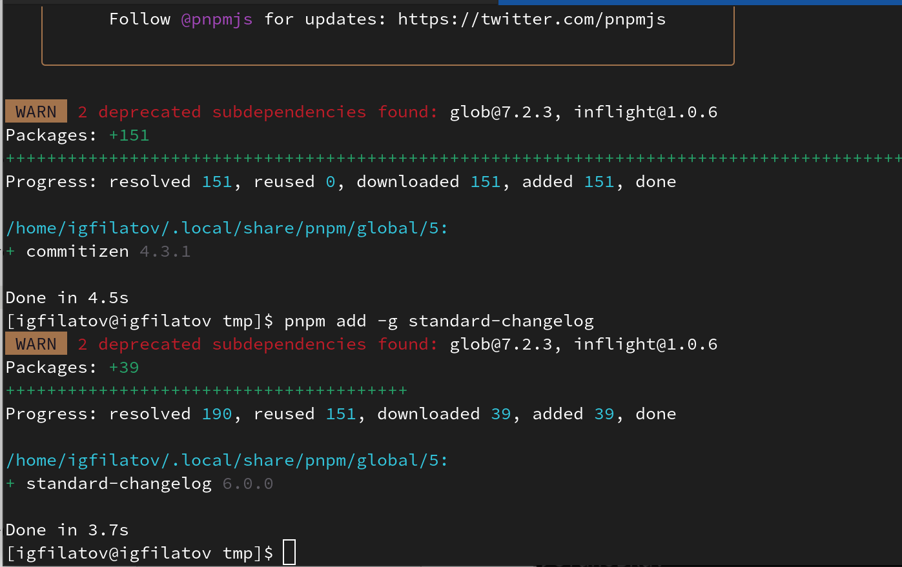
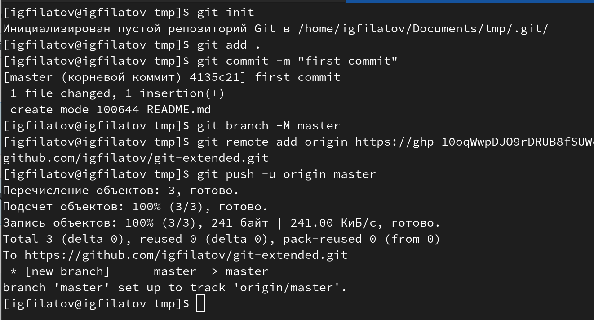
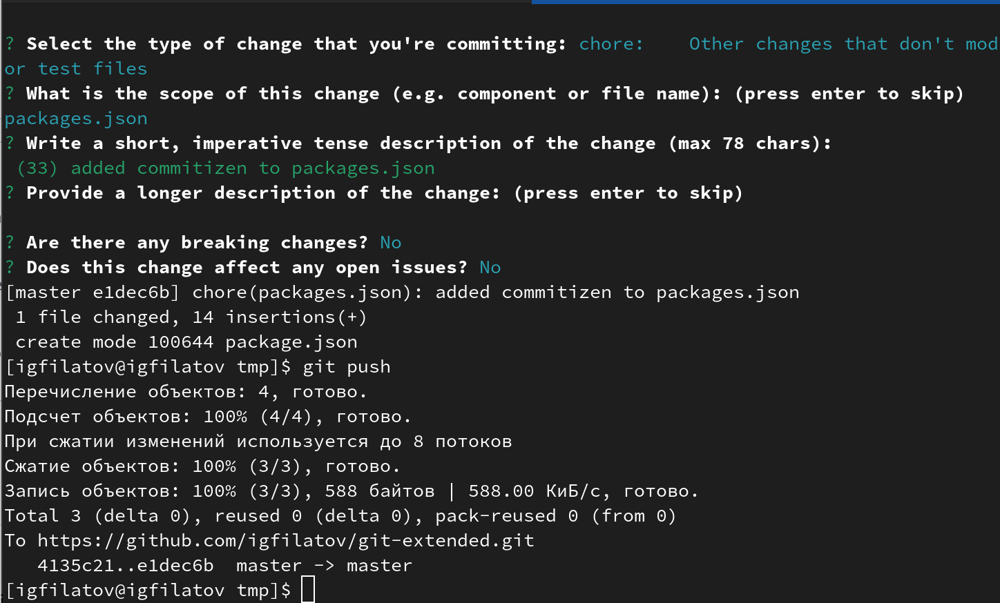
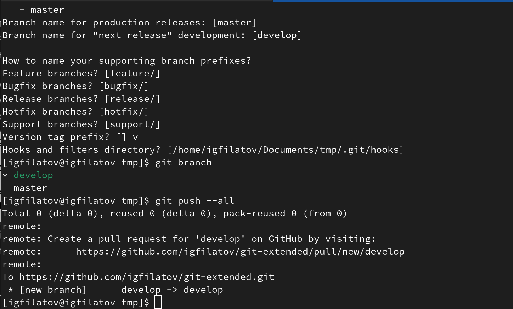
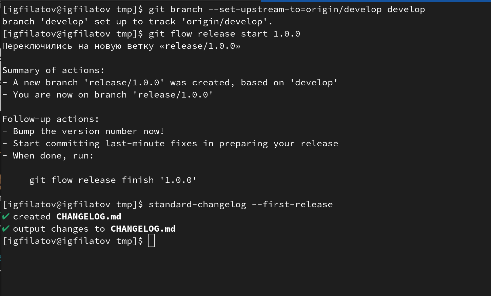
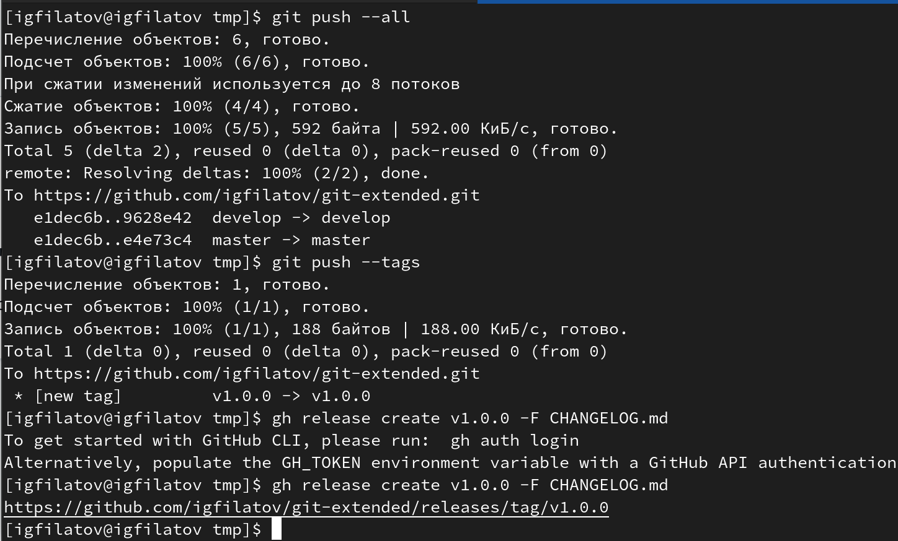
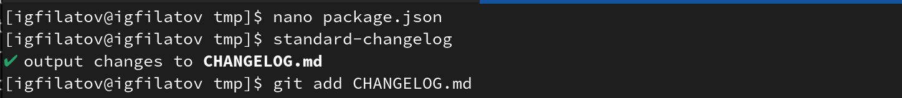
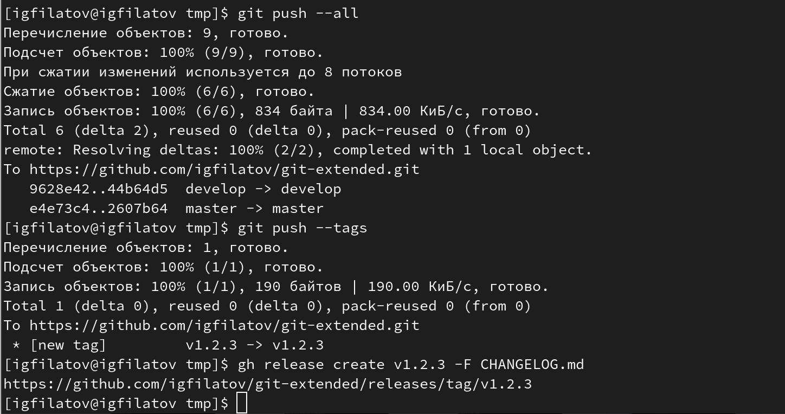

## Цель работы
- Получить навыки правильной работы с репозиториями git
- Освоить использование git-flow и conventional commits
- Научиться управлять версиями проекта

## Задание
- Преобразовать рабочий репозиторий в репозиторий с git-flow
- Настроить conventional commits
- Выполнить практический сценарий работы

## Установка инструментов

---

- Установка git-flow из репозитория Copr

{#fig:001 width=70%}

---

- Установка Node.js для семантического версионирования

{#fig:002 width=70%}

---

- Настройка Node.js и установка дополнительных пакетов

{#fig:004 width=70%}

---

{#fig:005 width=70%}

## Настройка репозитория

---

- Создание учебного репозитория на GitHub

{#fig:006 width=70%}

---

- Конфигурация conventional commits

{#fig:007 width=70%}

## Настройка git-flow

---

- Инициализация git-flow

{#fig:008 width=70%}

---

- Настройка ветки develop

{#fig:009 width=70%}

## Работа с репозиторием

---

- Создание релиза v1.0.0

{#fig:010 width=70%}

---

- Работа с новой функциональностью

{#fig:011 width=70%}

---

- Создание релиза v1.2.3

{#fig:012 width=70%}

---

{#fig:013 width=70%}

## Выводы
- Получены навыки работы с git-flow
- Освоено использование conventional commits
- Научились управлять версиями проекта

## Спасибо за внимание!