---
## Front matter
title: "Отчёт по лабораторной работе №4"
subtitle: "Дисциплина: Операционные системы"
author: "Филатов Илья Гурамович"
 
## Generic options
lang: ru-RU
toc-title: "Содержание"
 
## Bibliography
bibliography: bib/cite.bib
csl: pandoc/csl/gost-r-7-0-5-2008-numeric.csl
 
## Pdf output format
toc: true # Table of contents
toc-depth: 2
lof: true # List of figures
fontsize: 12pt
linestretch: 1.5
papersize: a4
documentclass: scrreprt
## I18n polyglossia
polyglossia-lang:
  name: russian
  options:
    - spelling=modern
    - babelshorthands=true
polyglossia-otherlangs:
  name: english
## I18n babel
babel-lang: russian
babel-otherlangs: english
## Fonts
mainfont: IBM Plex Serif
romanfont: IBM Plex Serif
sansfont: IBM Plex Sans
monofont: IBM Plex Mono
mathfont: STIX Two Math
mainfontoptions: Ligatures=Common,Ligatures=TeX,Scale=0.94
romanfontoptions: Ligatures=Common,Ligatures=TeX,Scale=0.94
sansfontoptions: Ligatures=Common,Ligatures=TeX,Scale=MatchLowercase,Scale=0.94
monofontoptions: Scale=MatchLowercase,Scale=0.94,FakeStretch=0.9
mathfontoptions:
## Biblatex
biblatex: true
biblio-style: "gost-numeric"
biblatexoptions:
  - parentracker=true
  - backend=biber
  - hyperref=auto
  - language=auto
  - autolang=other*
  - citestyle=gost-numeric
## Pandoc-crossref LaTeX customization
figureTitle: "Рис."
tableTitle: "Таблица"
listingTitle: "Листинг"
lofTitle: "Список иллюстраций"
lotTitle: "Список таблиц"
lolTitle: "Листинги"
## Misc options
indent: true
header-includes:
  - \usepackage{indentfirst}
  - \usepackage{float} # keep figures where there are in the text
  - \floatplacement{figure}{H} # keep figures where there are in the text
---
 
# Цель работы
- Получить навыки правильной работы с репозиториями git 
 
# Задание

1. Выполнить работу для тестового репозитория
- Преобразовать рабочий репозиторий в репозиторий с git-flow и conventional commits
 
# Выполнение лабораторной работы
 
## Установка git-flow
 
Установим gitflow из коллекции репозиториев Copr (рис. [-@fig:001]).
 
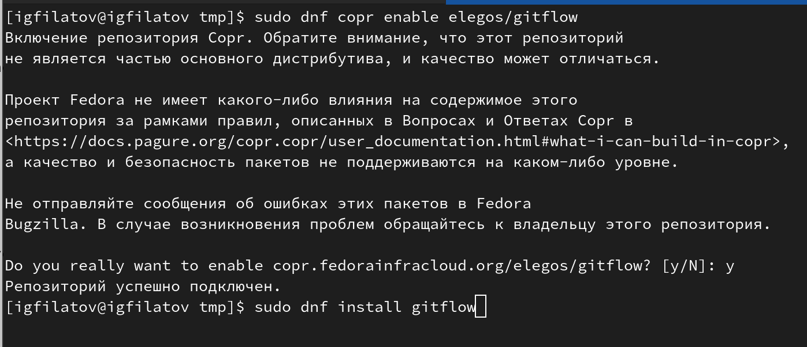{ #fig:001 width=70% }

## Установка Node.js
 
Также установим Node.js на котором базируется ПО для семантического версионирования коммитов (рис. [-@fig:003]).
 
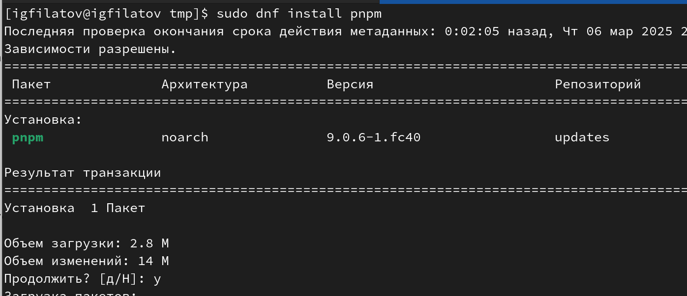{ #fig:003 width=70% }

## Настройки Node.js

Используя комманду pnpm setup и source `~/.bashrc` добавляем каталок с исполняемыми файлами от yarn в переменную PATH (рис. [-@fig:004]).
 
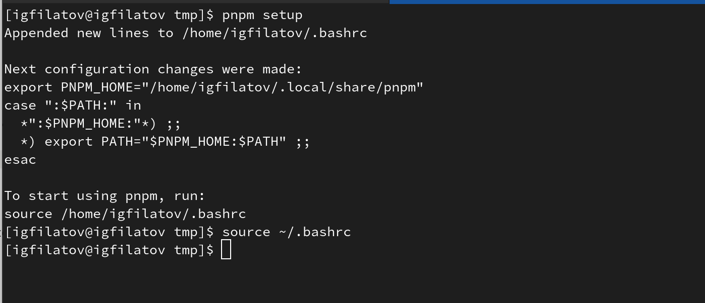{ #fig:004 width=70% }

Далее установим пакет commitizen для помощи в форматировании коммитов и пакет standard-changelog который используется для помощи в создании логов (рис. [-@fig:005]).
 
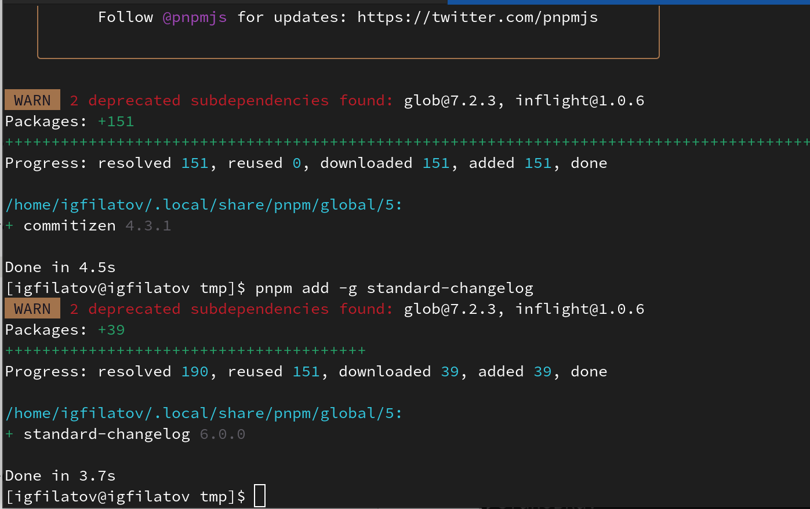{ #fig:005 width=70% }

## Практический сценарий использования git

### Создание репозитория github

Создадим учебный репозиторий на github и сделаем первый коммит (рис. [-@fig:006]).
 
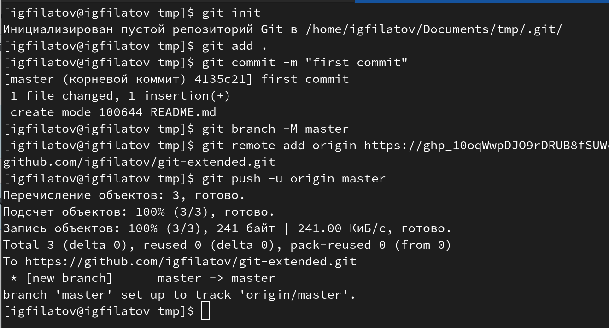{ #fig:006 width=70% }

Проведём конфигурацию общепринятых коммитов и сделаем повторный коммит (рис. [-@fig:007]).
 
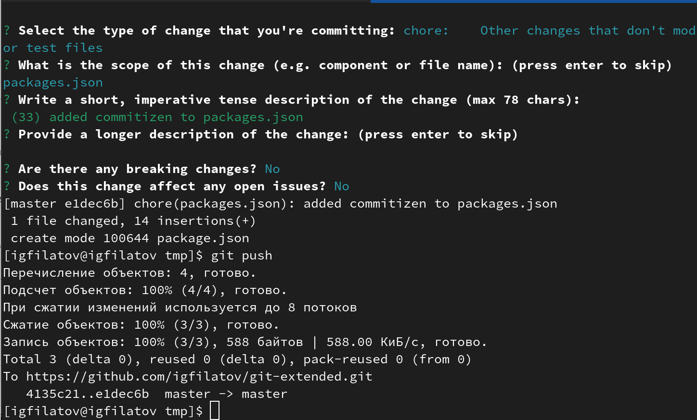{ #fig:007 width=70% }

## Конфигурация git-flow

Инициализируем git-flow устанавливая префикс для ярлыков в `v`, проверим что мы на ветке `develop` и загрузим весь репозиторий в хранилище (рис. [-@fig:008]).
 
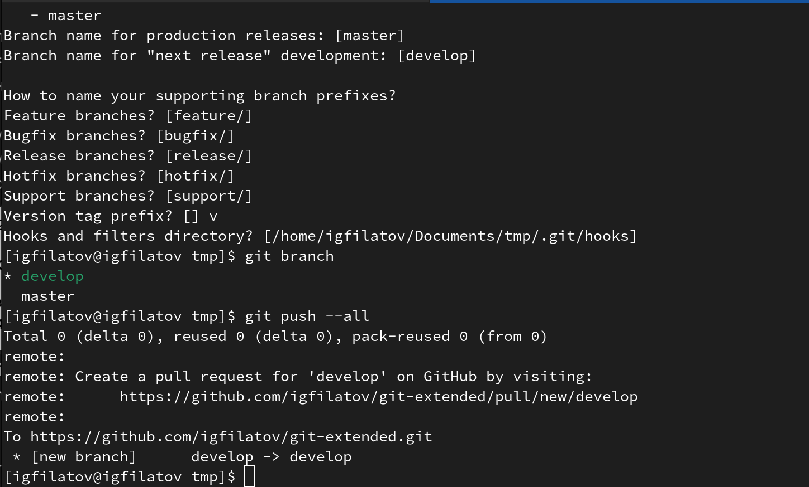{ #fig:008 width=70% }

Установим внешнюю ветку как вышестоящую для этой ветки и создадим релиз с версией 1.0.0 и журнал изменений (рис. [-@fig:009]).
 
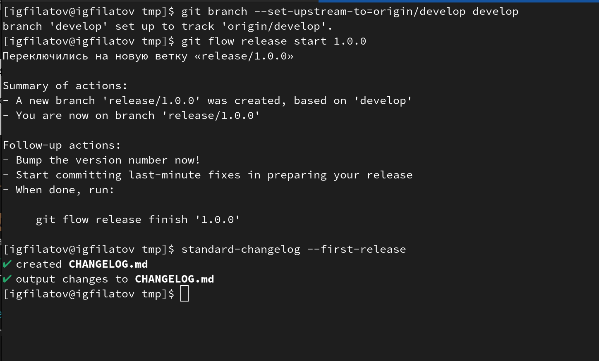{ #fig:009 width=70% }

Добавим изменения в индекс, зельём релизную ветвь в основную, отправим данные и создадим релиз на github (рис. [-@fig:010]).
 
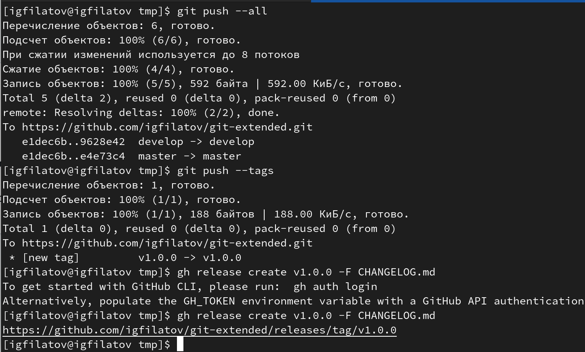{ #fig:010 width=70% }

## Работа с репозиторием git-flow

Для демонстрации создадим ветку новой функциональности и добавим релиз с версией 1.2.3 (рис. [-@fig:011]).
 
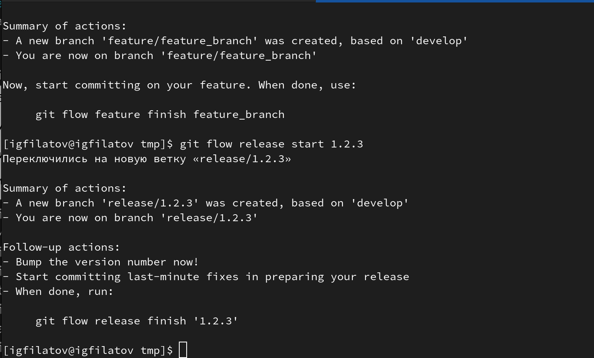{ #fig:011 width=70% }

Обновим номер версии в файле package.json, создадим журнал изменений и добавим в индекс (рис. [-@fig:012]).
 
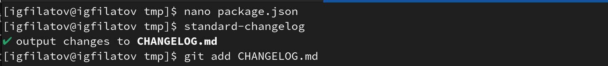{ #fig:012 width=70% }

Сделаем коммит, снова зальём ветку в основную и после отправки данных на github создаём релиз (рис. [-@fig:013]).
 
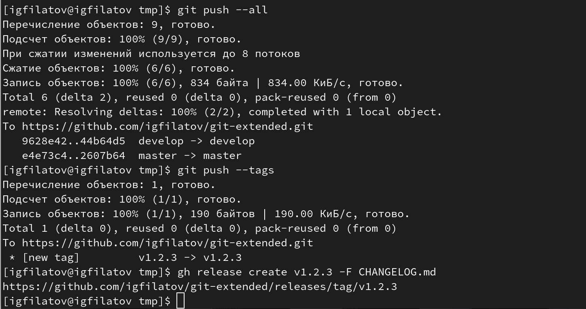{ #fig:013 width=70% }

В конце концов преобразуем наш рабочий репозиторий в репозиторий с git-flow и conventional commits
 
# Выводы
 
Я приобрёл навыки правильной работы с репозиториями git, git-flow и conventional commits
 
# Список литературы
 
1. [Архитектура ЭВМ](https://esystem.rudn.ru/pluginfile.php/2089548/mod_resource/content/0/%D0%9B%D0%B0%D0%B1%D0%BE%D1%80%D0%B0%D1%82%D0%BE%D1%80%D0%BD%D0%B0%D1%8F%20%D1%80%D0%B0%D0%B1%D0%BE%D1%82%D0%B0%20%E2%84%968.%20%D0%9F%D1%80%D0%BE%D0%B3%D1%80%D0%B0%D0%BC%D0%BC%D0%B8%D1%80%D0%BE%D0%B2%D0%B0%D0%BD%D0%B8%D0%B5%20%D1%86%D0%B8%D0%BA%D0%BB%D0%B0.%20%D0%9E%D0%B1%D1%80%D0%B0%D0%B1%D0%BE%D1%82%D0%BA%D0%B0%20%D0%B0%D1%80%D0%B3%D1%83%D0%BC%D0%B5%D0%BD%D1%82%D0%BE%D0%B2%20%D0%BA%D0%BE%D0%BC%D0%B0%D0%BD%D0%B4%D0%BD%D0%BE%D0%B9%20%D1%81%D1%82%D1%80%D0%BE%D0%BA%D0%B8..pdf)
