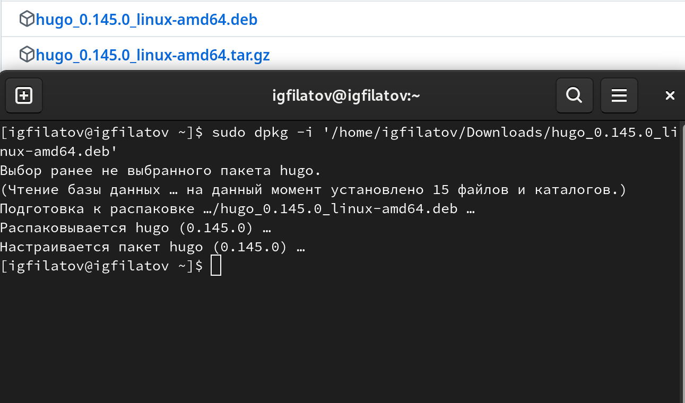
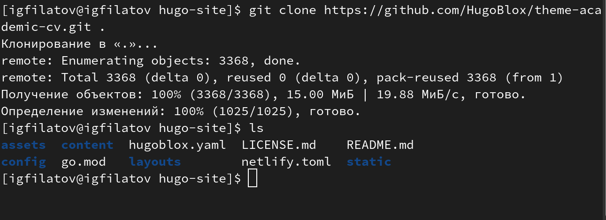
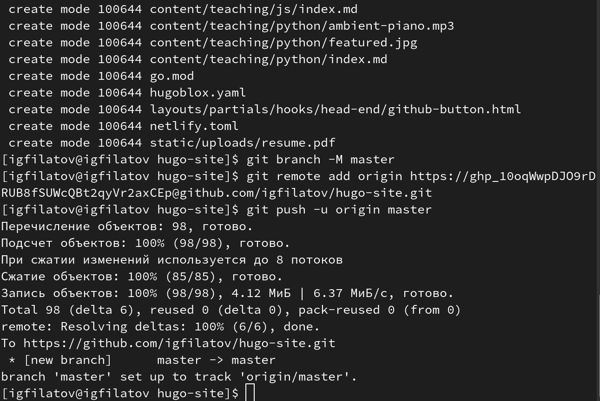
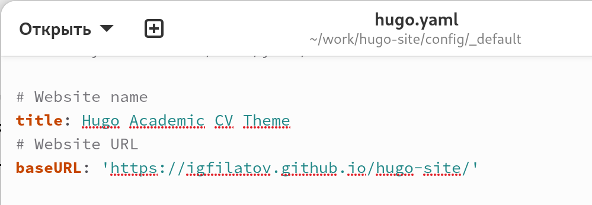
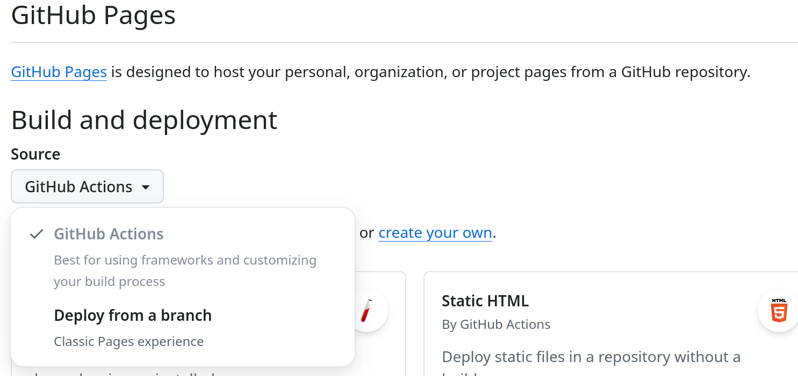
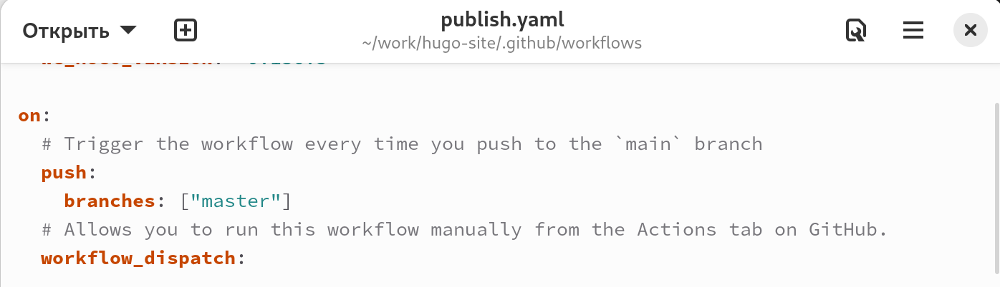
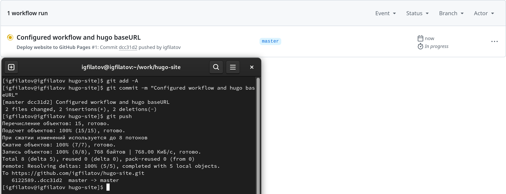

## Цель работы
- Разместить на Github pages заготовки для персонального сайта
- Научиться работать с Hugo и GitHub Pages
- Получить опыт веб-разработки

## Задание
- Установить необходимое ПО
- Скачать шаблон темы сайта
- Разместить его на хостинге git
- Установить параметр URLs сайта
- Разместить заготовку сайта на Github pages

## Установка Hugo

---

Скачивание Hugo с официального репозитория в формате '.deb' и его установка

{#fig:001 width=70%}

## Настройка репозитория

---

Клонирование репозитория шаблона для дальнейшей работы

{#fig:002 width=70%}

---

Инициализация git и связка с GitHub

{#fig:003 width=70%}

---

Настройка baseURL для корректного отображения

{#fig:004 width=70%}

## Размещение на GitHub Pages

---

Настройка параметров деплоя через GitHub Actions

{#fig:005 width=70%}

---

Настройка workflow для автоматического деплоя

{#fig:006 width=70%}

---

Запуск workflow и ожидание деплоя

{#fig:007 width=70%}

---

Проверка результата

{#fig:008 width=70%}

---

## Выводы
- Получен опыт работы с Hugo
- Настроен процесс автоматического деплоя
- Создана база для персонального сайта

## Спасибо за внимание!