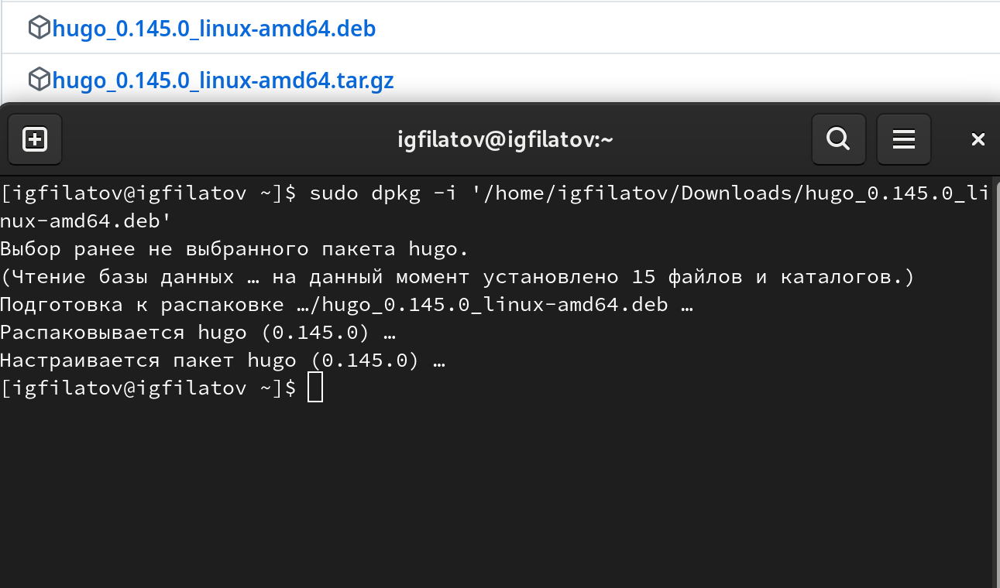
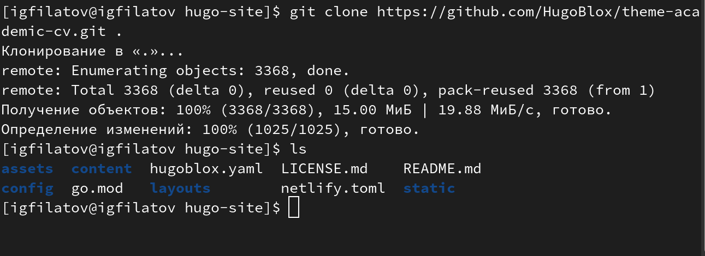
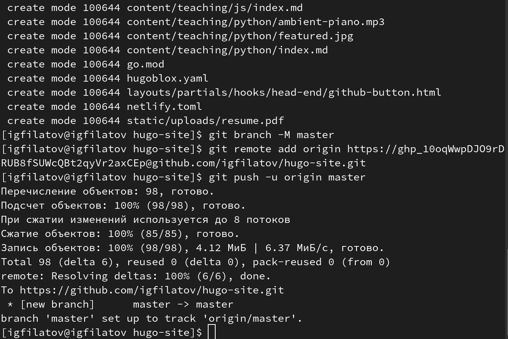
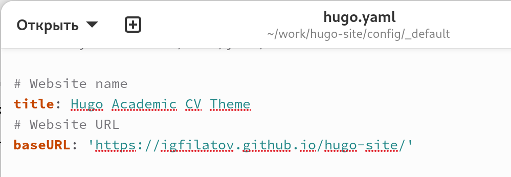
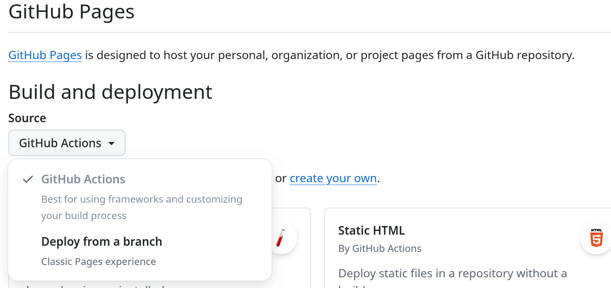
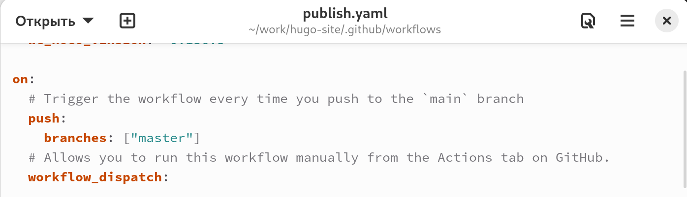
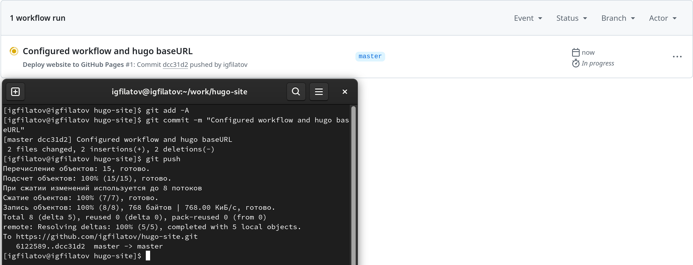
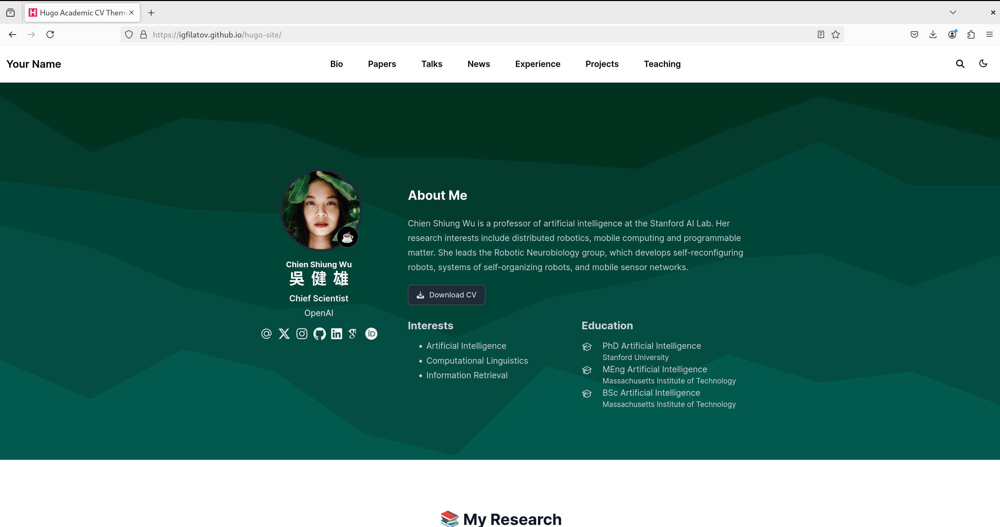

---
## Front matter
title: "Индивидуальный проект - отчёт №1"
subtitle: "Дисциплина: Операционные системы"
author: "Филатов Илья Гурамович"
 
## Generic options
lang: ru-RU
toc-title: "Содержание"
 
## Bibliography
bibliography: bib/cite.bib
csl: pandoc/csl/gost-r-7-0-5-2008-numeric.csl
 
## Pdf output format
toc: true # Table of contents
toc-depth: 2
lof: true # List of figures
fontsize: 12pt
linestretch: 1.5
papersize: a4
documentclass: scrreprt
## I18n polyglossia
polyglossia-lang:
  name: russian
  options:
    - spelling=modern
    - babelshorthands=true
polyglossia-otherlangs:
  name: english
## I18n babel
babel-lang: russian
babel-otherlangs: english
## Fonts
mainfont: IBM Plex Serif
romanfont: IBM Plex Serif
sansfont: IBM Plex Sans
monofont: IBM Plex Mono
mathfont: STIX Two Math
mainfontoptions: Ligatures=Common,Ligatures=TeX,Scale=0.94
romanfontoptions: Ligatures=Common,Ligatures=TeX,Scale=0.94
sansfontoptions: Ligatures=Common,Ligatures=TeX,Scale=MatchLowercase,Scale=0.94
monofontoptions: Scale=MatchLowercase,Scale=0.94,FakeStretch=0.9
mathfontoptions:
## Biblatex
biblatex: true
biblio-style: "gost-numeric"
biblatexoptions:
  - parentracker=true
  - backend=biber
  - hyperref=auto
  - language=auto
  - autolang=other*
  - citestyle=gost-numeric
## Pandoc-crossref LaTeX customization
figureTitle: "Рис."
tableTitle: "Таблица"
listingTitle: "Листинг"
lofTitle: "Список иллюстраций"
lotTitle: "Список таблиц"
lolTitle: "Листинги"
## Misc options
indent: true
header-includes:
  - \usepackage{indentfirst}
  - \usepackage{float} # keep figures where there are in the text
  - \floatplacement{figure}{H} # keep figures where there are in the text
---
 
# Цель работы
- Разместить на Github pages заготовки для персонального сайта
 
# Задание

1. Установить необходимое ПО
- Скачать шаблон темы сайта
- Разместить его на хостинге git
- Установить параметр URLs сайта
- Разместить заготовку сайта на Github pages
 
# Выполнение индивидуального проекта
 
## Установка Hugo
 
Скачаем и установим Hugo с оффициального репозитория на github (рис. [-@fig:001]).
 
{ #fig:001 width=70% }

## Настройка нового репозитория сайта

Клонируем репозиторий шаблона в папку для дальнейшей работы (рис. [-@fig:002]).
 
{ #fig:002 width=70% }

Инициализируем git репозиторий, делаем коммит, и связываем с новым репозиторием github (рис. [-@fig:003]).
 
{ #fig:003 width=70% }

Настроим параметр `baseURL` для корректного отображения после деплоя (рис. [-@fig:004]).
 
{ #fig:004 width=70% }

## Размещение заготовки сайта на Github pages

В репозитории на сайте github настроим параметры деплоя, сменим его на деплой через Github Actions (рис. [-@fig:005]).
 
{ #fig:005 width=70% }

Немного подправим существующий скрипт деплоя чтобы он сработал при следующем пуше (рис. [-@fig:006]).
 
{ #fig:006 width=70% }

Загружаем изменения на github и видим что происходит деплой (рис. [-@fig:007]).
 
{ #fig:007 width=70% }

Спустя некоторое время, видим что деплоинг прошёл успешно, заходим на наш сайт и видим опубликованный шаблон (рис. [-@fig:008]).
 
{ #fig:008 width=70% }

# Выводы
 
Я разместил заготовку своего будущего сайта визитки на хостинге Github pages
 
# Список литературы
 
1. [Архитектура ЭВМ](https://esystem.rudn.ru/pluginfile.php/2089548/mod_resource/content/0/%D0%9B%D0%B0%D0%B1%D0%BE%D1%80%D0%B0%D1%82%D0%BE%D1%80%D0%BD%D0%B0%D1%8F%20%D1%80%D0%B0%D0%B1%D0%BE%D1%82%D0%B0%20%E2%84%968.%20%D0%9F%D1%80%D0%BE%D0%B3%D1%80%D0%B0%D0%BC%D0%BC%D0%B8%D1%80%D0%BE%D0%B2%D0%B0%D0%BD%D0%B8%D0%B5%20%D1%86%D0%B8%D0%BA%D0%BB%D0%B0.%20%D0%9E%D0%B1%D1%80%D0%B0%D0%B1%D0%BE%D1%82%D0%BA%D0%B0%20%D0%B0%D1%80%D0%B3%D1%83%D0%BC%D0%B5%D0%BD%D1%82%D0%BE%D0%B2%20%D0%BA%D0%BE%D0%BC%D0%B0%D0%BD%D0%B4%D0%BD%D0%BE%D0%B9%20%D1%81%D1%82%D1%80%D0%BE%D0%BA%D0%B8..pdf)
